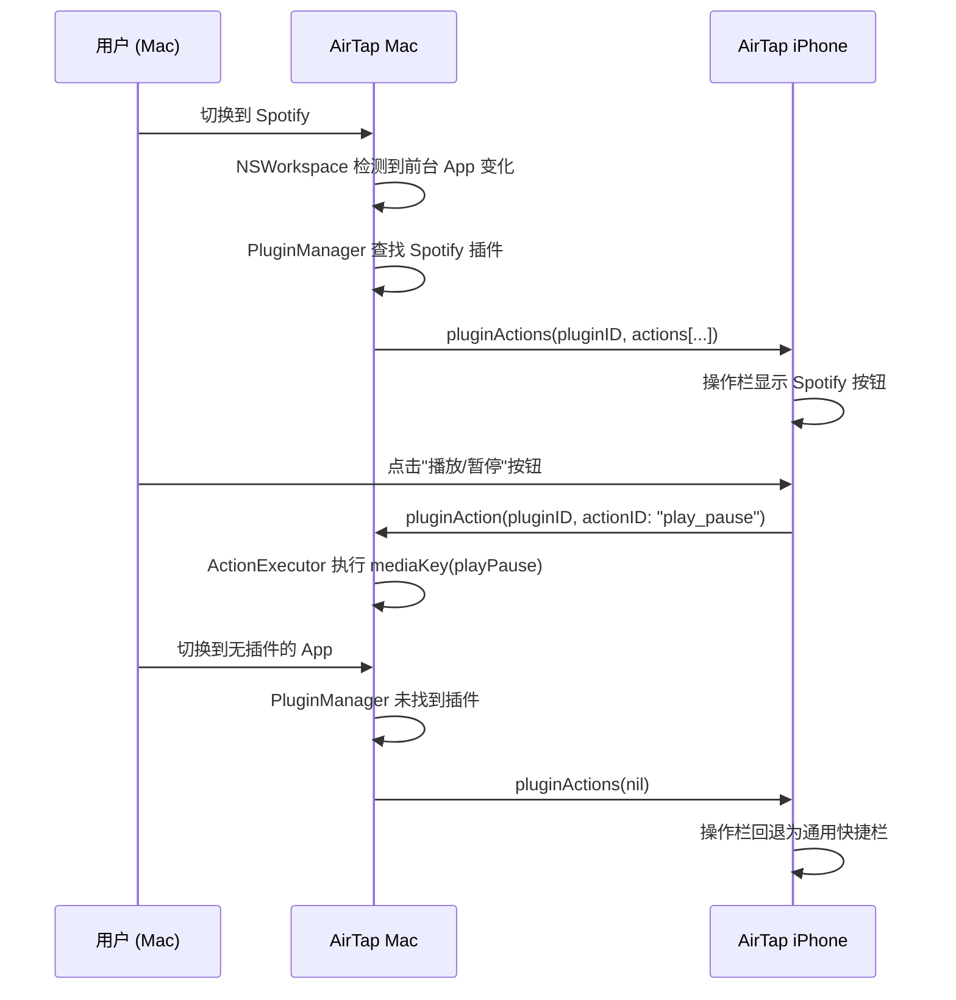
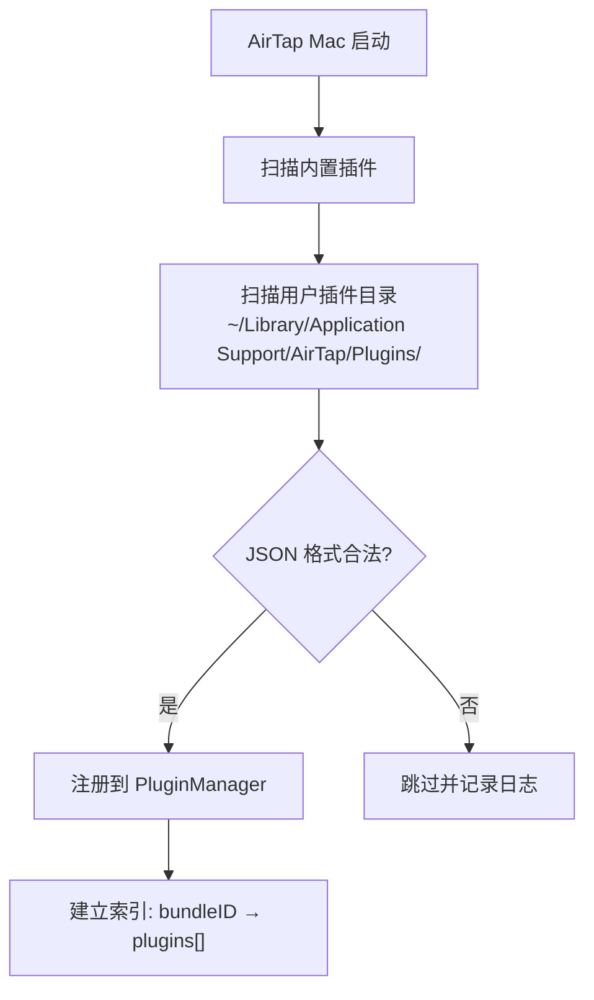

# App Context Actions (应用上下文操作) — 需求文档

## 背景与目标

### 背景

AirTap 当前的触控板模式提供了一组固定的通用快捷操作（复制、粘贴、撤销、音量等）。这些操作不会随着 Mac 前台应用的变化而变化，用户无法针对特定 App 执行专属操作。

MacBook 曾经的 Touch Bar 功能证明了"应用上下文操作"的价值——当用户切换到 Safari 时显示标签页控制，切换到音乐播放器时显示播放控制。这种体验显著提升了效率。

### 目标

1. **复刻 Touch Bar 体验**：当 Mac 前台应用切换时，iPhone 触控板自动展示该应用的专属操作栏
2. **开放生态**：通过简单的 JSON Manifest 格式，让开发者和极客用户都能为任意 App 创建插件
3. **零门槛使用**：普通用户无需任何配置，装好插件后只需点击按钮即可

### 关键架构原则

**插件只存在于 Mac 端，iPhone 端无需安装任何插件。**

- 插件（JSON Manifest 文件）仅部署在 Mac 的指定目录
- Mac 端负责加载插件、检测前台应用、查找匹配插件，然后将操作定义（按钮图标、标签、类型等）通过现有 TCP 连接发送给 iPhone
- iPhone 端纯粹作为"显示器 + 遥控器"——收到操作定义就渲染 UI，用户点击后将指令发回 Mac 执行
- 用户无需在两个设备上各管理一套插件，降低使用和维护成本

### 成功指标

- 用户在触控板模式下能看到当前 Mac 前台应用的专属操作
- 开发者可以在 5 分钟内为任意 App 创建一个基础插件
- 内置 3 个高质量插件作为范例

---

## 用户故事

### US-1: 用户使用 App 专属操作
> 作为一个 AirTap 用户，当我的 Mac 正在运行 Spotify 时，我切换到触控板模式，能看到播放/暂停、上一首、下一首等 Spotify 专属按钮，我点击就能控制音乐播放。

### US-2: 自动跟随前台应用
> 作为一个 AirTap 用户，当我在 Mac 上从 Safari 切换到 Finder 时，iPhone 上的操作栏自动从 Safari 操作（新标签页、刷新等）变为 Finder 操作（新建文件夹、显示简介等），无需我做任何操作。

### US-3: 无插件时的回退体验
> 作为一个 AirTap 用户，当我的 Mac 前台应用没有对应插件时，触控板仍然显示通用快捷栏（复制、粘贴、撤销等），和现在一样。

### US-4: 开发者创建静态插件
> 作为一个开发者/极客用户，我想为 VS Code 创建一个 AirTap 插件。我只需要写一个 JSON 文件，声明几个按钮和对应的快捷键，放到指定目录，重启后就能在触控板上看到这些按钮。

### US-5: 滑块和开关控制
> 作为一个 AirTap 用户，当 Spotify 插件提供了音量滑块时，我可以在触控板操作栏中直接拖动滑块调节音量，而不需要反复点击音量加减。

### US-6: 多插件合并
> 作为一个 AirTap 用户，如果我安装了两个 Safari 插件（一个提供标签页操作，一个提供书签操作），它们的按钮会合并显示在同一个操作栏中。

---

## 功能需求

### Must Have (MVP 必须)

| ID | 功能 | 描述 |
|----|------|------|
| F-1 | 前台应用检测 | Mac 端实时检测当前前台应用，将 bundleID 和应用名发送给 iPhone |
| F-2 | 静态插件加载 | Mac 端启动时扫描插件目录，按 targetBundleIds 建立索引 |
| F-3 | 插件 Manifest 格式 | 定义 JSON Manifest 格式规范，支持 button、toggle、slider、segmented 四种 UI 元素 |
| F-4 | 操作栏 UI | iPhone 触控板模式中，用操作栏替代现有快捷栏，显示当前 App 的插件操作 |
| F-5 | 操作执行 | Mac 端根据插件定义执行操作：keyPress、appleScript、shell、openURL、mediaKey |
| F-6 | 无插件回退 | 当前台 App 无对应插件时，显示默认通用快捷栏 |
| F-7 | 内置插件 | 内置 Finder、Safari、Music 三个插件作为范例 |
| F-8 | 协议扩展 | 扩展 iPhone ↔ Mac 通信协议，支持插件操作的传输 |
| F-9 | 基础状态同步 | 支持 toggle 的开/关状态、slider 的当前值回传给 iPhone |

### Should Have (应该有)

| ID | 功能 | 描述 |
|----|------|------|
| F-10 | 多插件合并 | 同一 App 的多个插件操作合并显示 |
| F-11 | 切换动画 | App 切换时操作栏平滑过渡动画 |
| F-12 | 插件热加载 | 修改插件 JSON 后无需重启即可生效 |
| F-13 | 横屏适配 | 操作栏在横屏模式下正确布局 |

### Nice to Have (锦上添花)

| ID | 功能 | 描述 |
|----|------|------|
| F-14 | 插件管理 UI | Mac 端提供插件列表管理界面 |
| F-15 | 插件验证 | 加载时校验 Manifest 格式，给出友好错误提示 |
| F-16 | 操作栏自定义顺序 | 用户可以拖拽调整操作按钮的顺序 |

---

## 非功能需求

| ID | 类别 | 要求 |
|----|------|------|
| NF-1 | 性能 | App 切换到操作栏更新延迟 < 200ms |
| NF-2 | 兼容性 | 不影响现有触控板、键盘、App 启动器等功能 |
| NF-3 | 安全 | 完全信任用户安装的插件，不做沙盒限制 |
| NF-4 | 可扩展性 | Manifest 格式预留版本号字段，便于后续扩展 |
| NF-5 | 开发者体验 | 一个基础插件 5 分钟内可创建完成 |

---

## 交互流程

### 主流程：App 切换 → 操作栏更新

### 插件加载流程

---

## 验收标准

### AC-1: 前台应用检测
- [ ] Mac 端能检测到前台应用切换事件
- [ ] 切换事件能在 100ms 内到达 iPhone 端

### AC-2: 静态插件加载
- [ ] 启动时能正确扫描并加载内置插件和用户插件
- [ ] 格式错误的 JSON 不会导致崩溃

### AC-3: 操作栏显示
- [ ] 有插件时，操作栏显示该插件的所有操作按钮
- [ ] 无插件时，显示默认通用快捷栏
- [ ] 按钮显示图标和标签文字

### AC-4: 操作执行
- [ ] 点击按钮能正确执行对应的快捷键/AppleScript/Shell 命令
- [ ] slider 拖动能实时执行
- [ ] toggle 点击能切换状态

### AC-5: 内置插件
- [ ] Finder 插件：新建窗口、新建文件夹、显示简介、删除
- [ ] Safari 插件：新标签页、刷新、前进、后退、关闭标签
- [ ] Music 插件：上一首、播放暂停、下一首、音量滑块

### AC-6: 状态同步
- [ ] toggle 的开关状态能从 Mac 同步到 iPhone 显示
- [ ] slider 的当前值能从 Mac 同步到 iPhone 显示

---

## 开放问题

| ID | 问题 | 状态 |
|----|------|------|
| Q-1 | 用户插件目录路径是否需要支持自定义？ | 待定 |
| Q-2 | 是否需要支持插件定义图标颜色/主题色？ | 待定 |
| Q-3 | 状态同步的轮询间隔应该设为多少？（涉及性能 vs 实时性） | 待定，建议 1-2 秒 |
| Q-4 | 后续动态协议（MCP 风格）的具体规范 | Phase 2 讨论 |
