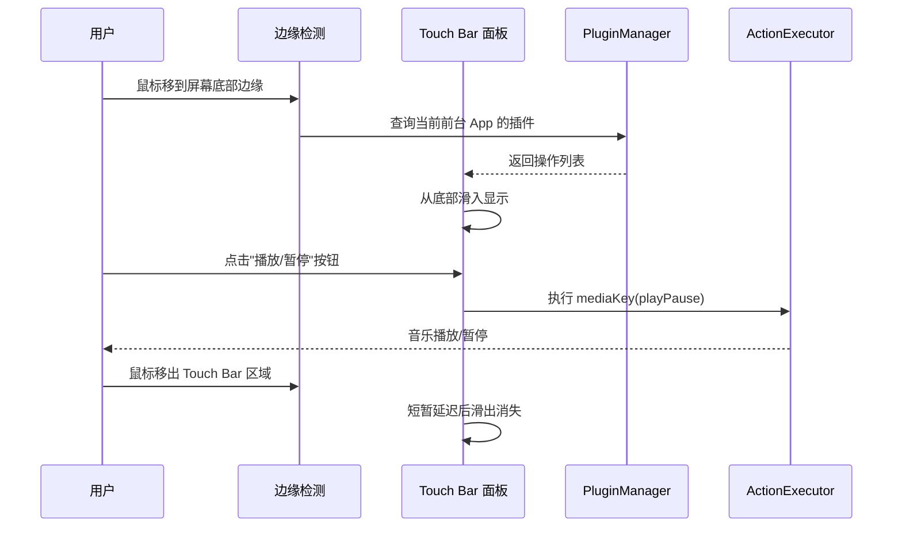
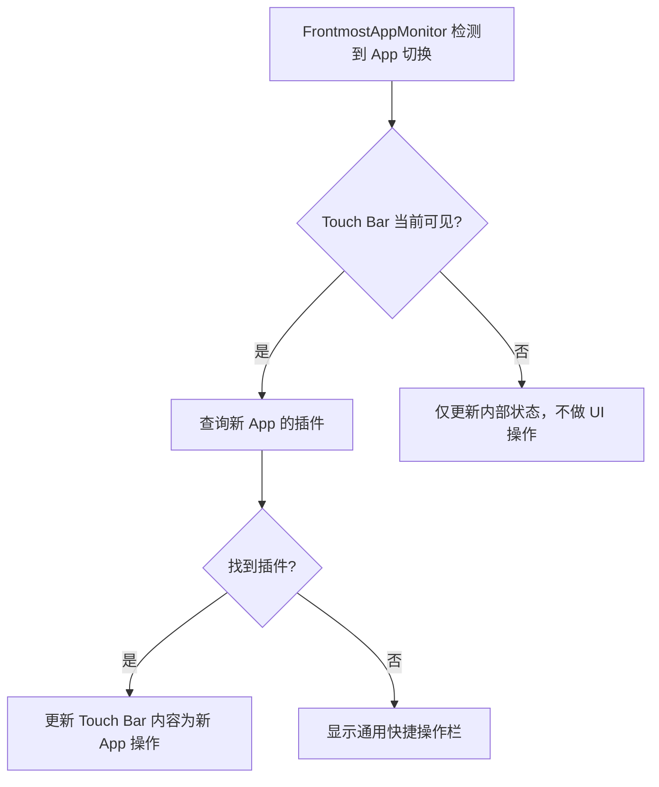
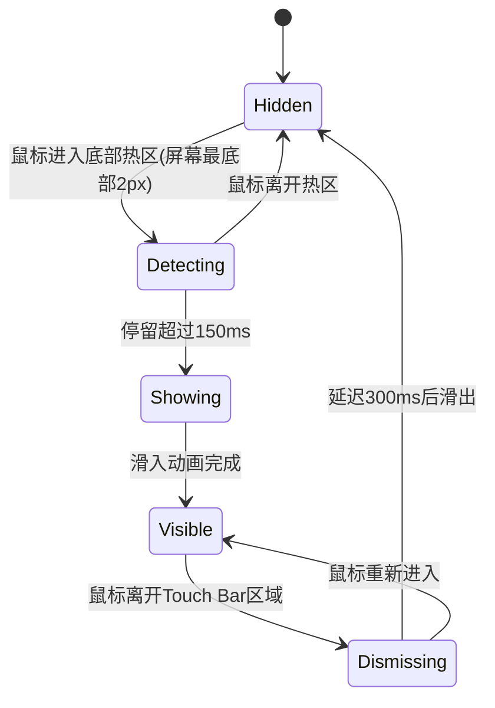

# Mac 原生 Touch Bar — 需求文档

## 背景与目标

### 背景

Apple 在 2016 年推出 MacBook Pro Touch Bar，随后在 2021 年将其移除。许多用户仍然怀念 Touch Bar 带来的上下文操作体验——在不同应用间切换时，操作栏自动展示当前应用的专属快捷操作。

目前市场上没有一个轻量级、开源的解决方案能在任意 Mac 上复刻这种体验，同时提供开放的开发者接入能力。

### 目标

1. **让任何 Mac 重获 Touch Bar**：用户鼠标移到屏幕底部边缘时，自动弹出一个浮动操作栏，显示当前前台应用的专属操作
2. **开发者生态**：通过简单的 JSON Manifest 格式，让任何人都能为任意 App 创建 Touch Bar 插件
3. **快速验证**：以最小可行产品快速上线，验证市场需求和插件生态

### 产品定位

- 作为 AirTapMac 的独立功能模块，即使不连接 iPhone 也能使用
- 未来可同时作为独立产品分发
- 插件格式与 AirTap iPhone Touch Bar（后续功能）完全兼容

### 成功指标

- 鼠标移到底部边缘 → 操作栏弹出 → 点击按钮执行操作，全程流畅无卡顿
- 开发者 5 分钟内可创建一个基础插件
- 内置 3 个高质量插件作为范例
- 适合在 Product Hunt / Hacker News / Reddit 上推广的演示效果

---

## 关键架构原则

**纯 Mac 端实现，无需网络通信。**

- 插件 JSON 文件存放在 Mac 本地目录
- 前台应用检测、插件加载、操作执行、UI 渲染全部在 Mac 端完成
- 复用已完成的 PluginManifest 数据模型和 FrontmostAppMonitor
- 后续 iPhone Touch Bar 功能将共享同一套插件系统

---

## 用户故事

### US-1: 鼠标唤起 Touch Bar
> 作为一个 Mac 用户，当我把鼠标移到屏幕最底部边缘时，一个操作栏从底部滑出，显示在 Dock 上方。我移开鼠标后，操作栏自动消失。

### US-2: 应用专属操作
> 作为一个 Mac 用户，当我在 Spotify 中听歌时，唤起 Touch Bar 能看到播放/暂停、上一首、下一首、音量滑块等操作。当我切换到 Safari 后再唤起，看到的是新标签页、刷新、前进、后退等操作。

### US-3: 无插件回退
> 作为一个 Mac 用户，当前台应用没有对应插件时，Touch Bar 显示通用操作（复制、粘贴、撤销、音量、播放等），仍然有用。

### US-4: 开发者创建插件
> 作为一个开发者，我只需要写一个 JSON 文件，声明我的应用支持哪些操作，放到 `~/Library/Application Support/AirTap/Plugins/` 目录，Touch Bar 就会自动加载并在对应 App 前台时展示。

### US-5: 交互控件
> 作为一个 Mac 用户，Touch Bar 中不仅有按钮，还有滑块（如音量调节）和开关（如静音切换），我可以直接在操作栏中拖动滑块或点击开关。

### US-6: 不干扰正常操作
> 作为一个 Mac 用户，Touch Bar 的弹出和消失不会抢夺我当前窗口的焦点，我在任何应用中操作时，Touch Bar 是一个"辅助面板"而非"弹窗"。

---

## 功能需求

### Must Have (MVP 必须)

| ID | 功能 | 描述 |
|----|------|------|
| F-1 | 底部边缘触发 | 鼠标移到屏幕最底部边缘时触发 Touch Bar 弹出 |
| F-2 | 浮动操作栏 UI | macOS 原生毛玻璃风格的浮动面板，居中显示在 Dock 上方 |
| F-3 | 鼠标离开自动收起 | 鼠标移出 Touch Bar 区域后自动收起（带短暂延迟避免误触） |
| F-4 | 前台应用检测 | 实时检测当前前台应用（复用 FrontmostAppMonitor） |
| F-5 | 插件加载与匹配 | 启动时加载插件 JSON，按前台 App 的 bundleID 匹配 |
| F-6 | 按钮操作 | 支持 button 类型：显示图标+标签，点击执行操作 |
| F-7 | 操作执行 | 支持 keyPress、appleScript、shell、openURL、mediaKey 五种执行类型 |
| F-8 | 无插件回退 | 无插件时显示通用快捷操作栏（复制/粘贴/撤销/音量/播放等） |
| F-9 | 内置插件 | 内置 Finder、Safari、Music 三个插件 |
| F-10 | 不抢夺焦点 | Touch Bar 面板不影响当前窗口的焦点状态 |
| F-11 | 菜单栏图标 | 在 macOS 菜单栏显示图标，提供开/关 Touch Bar 功能的入口 |

### Should Have (应该有)

| ID | 功能 | 描述 |
|----|------|------|
| F-12 | 滑块控件 | 支持 slider 类型：内联滑块，拖动实时执行 |
| F-13 | 开关控件 | 支持 toggle 类型：点击切换开/关状态 |
| F-14 | 弹出/收起动画 | 平滑的滑入滑出动画 |
| F-15 | 应用切换过渡 | 前台 App 切换时，Touch Bar 内容平滑过渡 |
| F-16 | 基础状态同步 | slider 和 toggle 通过 AppleScript 查询当前值并显示 |

### Nice to Have (锦上添花)

| ID | 功能 | 描述 |
|----|------|------|
| F-17 | 全局快捷键 | 额外支持快捷键唤起/关闭 Touch Bar |
| F-18 | 插件热加载 | 修改插件 JSON 后无需重启即可生效 |
| F-19 | 多显示器支持 | 在鼠标所在的显示器上弹出 Touch Bar |
| F-20 | 宽度自适应 | Touch Bar 宽度根据操作数量自动调整 |
| F-21 | Esc 键 | Touch Bar 左侧显示 Esc 按键，致敬真实 Touch Bar |

---

## 非功能需求

| ID | 类别 | 要求 |
|----|------|------|
| NF-1 | 性能 | 鼠标触发到 Touch Bar 完全显示 < 100ms |
| NF-2 | 性能 | 点击操作到执行完成 < 50ms（keyPress 类型） |
| NF-3 | 资源占用 | 空闲时 CPU 占用 < 1%，内存 < 30MB |
| NF-4 | 兼容性 | macOS 13.0 (Ventura) 及以上 |
| NF-5 | 兼容性 | 不影响 AirTapMac 现有的 iPhone 远程控制功能 |
| NF-6 | 安全 | 完全信任用户安装的插件，不做沙盒限制 |
| NF-7 | 可扩展性 | 插件 Manifest 格式与 AirTap iPhone Touch Bar 完全兼容 |

---

## 交互流程

### 主流程：唤起 → 使用 → 收起



### 前台 App 切换流程



### 边缘触发细节



---

## 视觉设计

### 整体布局

```
┌─────────────────────────────────────────────────────┐
│                    macOS 桌面                         │
│                                                      │
│                                                      │
│                                                      │
│  ┌────────────────────────────────────────────────┐  │
│  │  Spotify │ ◀◀ │ ▶❚❚ │ ▶▶ │ ──●────── 🔊 │    │  │ ← Touch Bar (毛玻璃)
│  └────────────────────────────────────────────────┘  │
│  ┌────────────────────────────────────────────────┐  │
│  │                    Dock                         │  │
│  └────────────────────────────────────────────────┘  │
└─────────────────────────────────────────────────────┘
```

### 视觉规范

- **背景**: macOS 原生 `.hudWindow` 或 `NSVisualEffectView` 毛玻璃材质
- **圆角**: 10-12pt，与 macOS 系统风格一致
- **按钮**: 圆角矩形，hover 高亮，点击反馈
- **高度**: 约 48-56pt（与真实 Touch Bar 接近）
- **宽度**: 自适应内容，最大不超过屏幕宽度的 70%
- **间距**: 与 Dock 顶部保持 8-12pt 间距
- **阴影**: 轻微投影，增加悬浮感

---

## 验收标准

### AC-1: 边缘触发
- [ ] 鼠标移到屏幕最底部边缘，停留 150ms 后 Touch Bar 滑入
- [ ] 快速划过底部边缘不会触发（防误触）
- [ ] Dock 设置为自动隐藏时仍能正常触发

### AC-2: Touch Bar 显示
- [ ] 毛玻璃材质、圆角、悬浮阴影
- [ ] 显示在 Dock 上方，不遮挡 Dock
- [ ] 不抢夺当前窗口焦点

### AC-3: 插件操作
- [ ] 有插件时显示对应 App 的操作按钮
- [ ] 无插件时显示通用快捷操作
- [ ] 点击按钮能正确执行操作

### AC-4: 收起
- [ ] 鼠标离开 Touch Bar 区域后延迟 300ms 自动收起
- [ ] 收起前鼠标回来则取消收起
- [ ] 收起有平滑滑出动画

### AC-5: 内置插件
- [ ] Finder: 新建窗口、新建文件夹、显示简介、删除
- [ ] Safari: 新标签页、刷新、前进、后退、关闭标签
- [ ] Music: 上一首、播放暂停、下一首、音量滑块

### AC-6: 系统集成
- [ ] 菜单栏图标可开关 Touch Bar 功能
- [ ] 不影响 AirTapMac 现有的 iPhone 连接功能
- [ ] App 前台切换时 Touch Bar 内容跟随变化

---

## 与 AirTap iPhone Touch Bar 的关系

| 维度 | Mac 原生 Touch Bar | iPhone Touch Bar (后续) |
|------|-------------------|------------------------|
| 插件格式 | PluginManifest JSON | 完全相同 |
| 前台检测 | FrontmostAppMonitor | 完全相同 |
| 插件管理 | PluginManager | 完全相同 |
| 操作执行 | ActionExecutor | 完全相同 |
| UI 渲染 | Mac NSPanel + SwiftUI | iPhone SwiftUI |
| 通信 | 无 (本地) | TCP 协议传输操作定义 |

**结论**: 共享层代码 100% 复用。Mac Touch Bar 做完后，iPhone Touch Bar 只需要新增协议扩展和 iOS 端 UI。

---

## 开放问题

| ID | 问题 | 状态 |
|----|------|------|
| Q-1 | Dock 自动隐藏模式下，底部边缘触发区域会和 Dock 的触发冲突吗？需要测试 | 待验证 |
| Q-2 | 多显示器场景下 Touch Bar 在哪个屏幕显示？MVP 只考虑主显示器 | MVP 只做主屏 |
| Q-3 | Touch Bar 是否需要支持拖拽调整位置？ | MVP 不做 |
| Q-4 | 是否需要支持 Esc 键显示？ | Nice to Have |
| Q-5 | 状态同步 (slider/toggle) 的轮询间隔？ | 建议 1 秒 |
