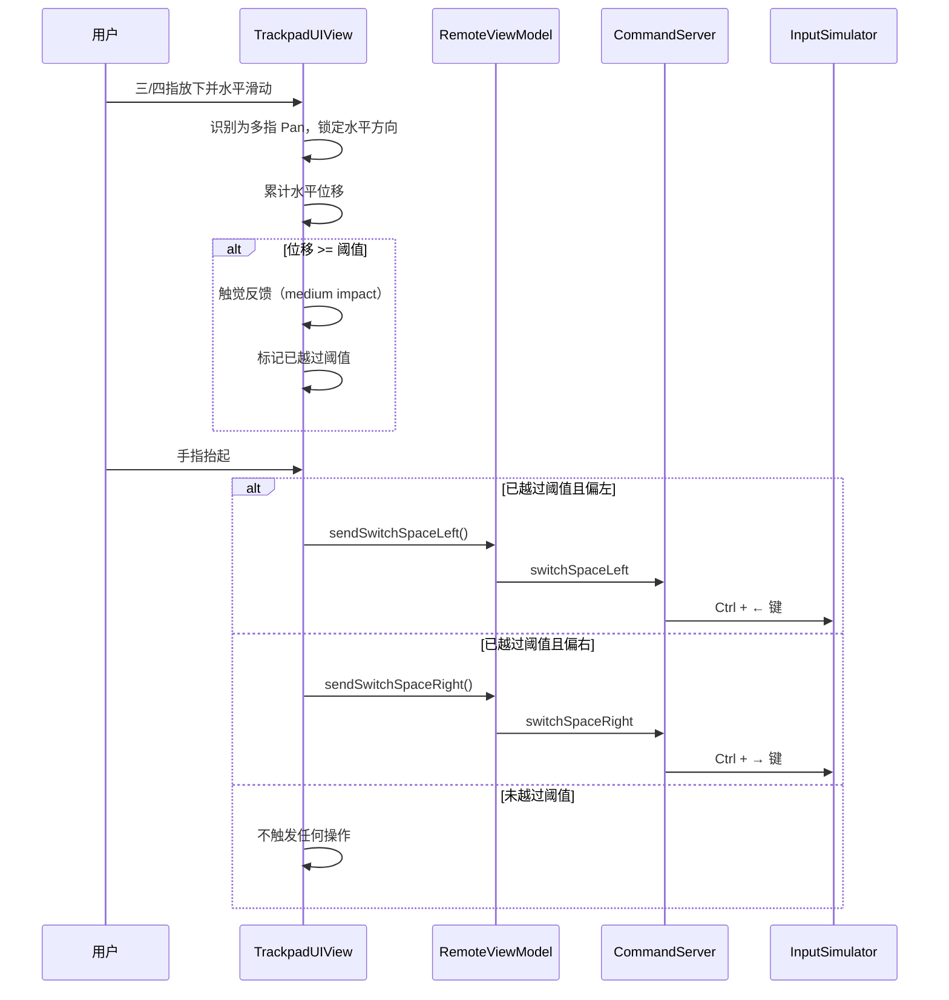
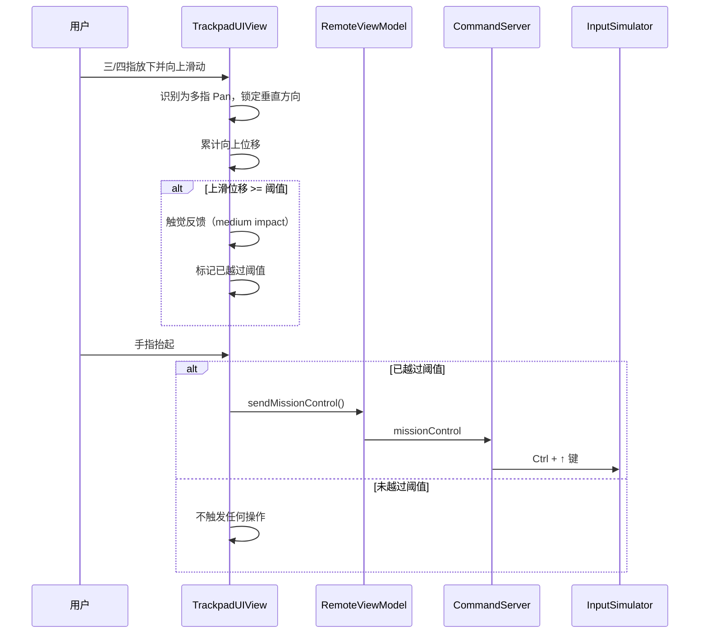
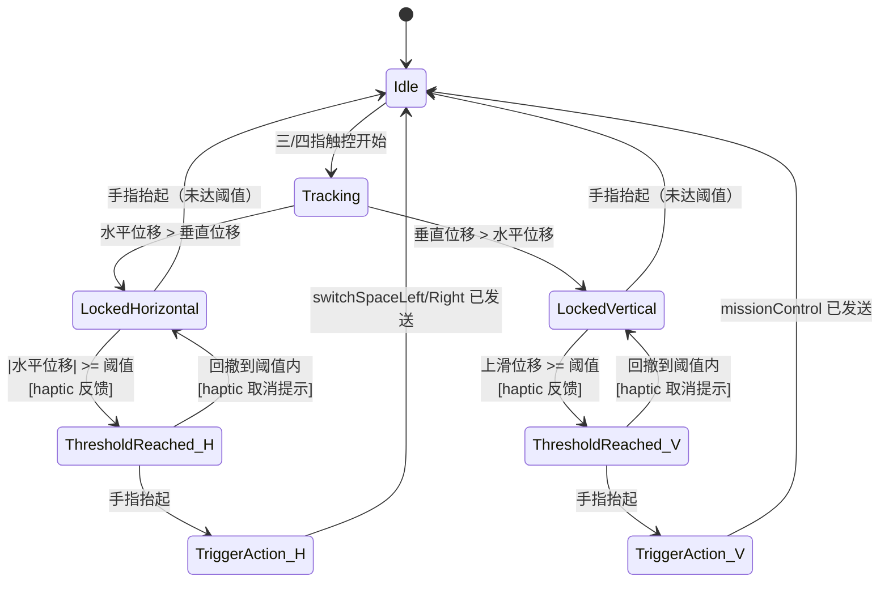

# 多指滑动手势 — 需求文档

## 背景与目标

### 背景

AirTap 当前已支持单指移动光标、双指滚动、双指缩放等触控板手势，但**缺少三指/四指滑动手势**。在真实 Mac 触控板上，三指/四指左右滑动用于切换桌面空间（Spaces），上滑用于调出调度中心（Mission Control），这是 macOS 最高频的多指手势之一。

目前通信协议和 Mac 端执行层已具备 `switchSpaceLeft`、`switchSpaceRight`、`missionControl` 命令支持，但 iOS 触控板视图中**没有注册三指/四指手势识别器**，导致这些命令无法被触发。

### 目标

1. **补全手势矩阵**：在 iOS 触控板上支持三指和四指左右滑动切换 Mac 桌面空间，上滑调出调度中心
2. **原生体验**：滑动过程有「阻力感」，达到阈值时给予触觉反馈，松手后触发操作，尽可能接近 Mac 原生触控板体验
3. **兼容性验证**：确认 iOS 是否会拦截三指/四指手势，必要时提供引导

### 成功指标

- 三指或四指左右滑动 → Mac 桌面空间成功切换，成功率 > 95%
- 三指或四指上滑 → Mac 调度中心成功弹出
- 滑动到阈值时有明确的触觉反馈，用户能感知「已就绪」
- 误触率 < 5%（滑动距离不够不会误触发）

---

## 用户故事

### US-1: 左右滑动切换桌面

> 作为一个 AirTap 用户，当我在 iPhone 触控板上用三根（或四根）手指向左滑动时，Mac 切换到左侧桌面空间；向右滑动时，切换到右侧桌面空间。滑动过程中有阻力感，到达阈值时手机振动提示，松手后 Mac 执行切换。

### US-2: 上滑调出调度中心

> 作为一个 AirTap 用户，当我在 iPhone 触控板上用三根（或四根）手指向上滑动时，Mac 调出调度中心（Mission Control）。同样有阻力感和触觉反馈。

### US-3: 滑动未达阈值取消操作

> 作为一个 AirTap 用户，当我用三指/四指滑动但距离不够时，松手后不执行任何操作，避免误触。

### US-4: 系统手势冲突引导

> 作为一个 AirTap 用户，如果 iOS 系统拦截了我的三指/四指手势（导致功能不可用），应用应该告诉我如何在系统设置中关闭冲突的手势。

---

## 功能需求

### Must Have (必须)

| ID | 功能 | 描述 |
|----|------|------|
| F-1 | 三指左右滑动 | 三指左/右滑动触发 `switchSpaceLeft` / `switchSpaceRight` |
| F-2 | 四指左右滑动 | 四指左/右滑动触发 `switchSpaceLeft` / `switchSpaceRight` |
| F-3 | 三指上滑 | 三指上滑触发 `missionControl` |
| F-4 | 四指上滑 | 四指上滑触发 `missionControl` |
| F-5 | 阻力阈值 | 滑动距离需超过阈值（建议 80-120pt）才会触发操作 |
| F-6 | 触觉反馈 | 达到阈值时给予明确的 haptic 反馈（medium impact），让用户感知「已就绪」 |
| F-7 | 松手触发 | 操作在手指抬起时才执行，不在滑动过程中触发 |
| F-8 | 方向锁定 | 开始滑动后锁定主方向（水平 or 垂直），避免斜向滑动同时触发两种操作 |
| F-9 | iOS 手势冲突检测 | 添加调试日志，验证 iOS 是否拦截三指/四指触控事件 |

### Should Have (应该有)

| ID | 功能 | 描述 |
|----|------|------|
| F-10 | 过阈值后回撤取消 | 用户滑过阈值后又滑回来，则取消操作并再次触觉反馈提示 |
| F-11 | 手势指引 | 首次使用时显示简短的手势提示（三指/四指滑动可切换桌面） |

### Nice to Have (锦上添花)

| ID | 功能 | 描述 |
|----|------|------|
| F-12 | 三指下滑 | 三指下滑触发 App Exposé（`appExpose` 命令，需协议扩展） |
| F-13 | 阈值可配置 | 用户可在设置中调整触发灵敏度 |
| F-14 | 视觉进度指示 | 滑动过程中在屏幕边缘显示微弱的方向指示 |

---

## 非功能需求

| ID | 类别 | 要求 |
|----|------|------|
| NF-1 | 兼容性 | 三指/四指手势不影响现有单指、双指手势的正常工作 |
| NF-2 | 兼容性 | 支持 iOS 16.0 及以上 |
| NF-3 | 性能 | 手势识别到命令发送延迟 < 50ms |
| NF-4 | 误触防护 | 与双指滚动手势不冲突（双指滑动仍然是滚动） |
| NF-5 | 不影响现有 | 不修改已有的 `RemoteCommand` 协议枚举（`switchSpaceLeft` / `switchSpaceRight` / `missionControl` 已存在） |

---

## 交互流程

### 主流程：三/四指左右滑动切换桌面

### 三/四指上滑调出调度中心

### 方向锁定与阈值状态机

---

## iOS 手势冲突分析

### 已知的 iOS 系统手势

| 系统手势 | 触发条件 | 可能冲突 |
|----------|----------|----------|
| 撤销/重做 | 三指左右滑动 | **高冲突** — 与我们的三指左右滑完全相同 |
| 复制/剪切/粘贴浮条 | 三指捏合/张开 | 低冲突 — 不同手势类型 |
| 辅助功能缩放 | 三指双击 | 低冲突 — 不同手势类型 |
| iPad 多任务切换 | 四指/五指滑动 | 不适用（iPhone 无此手势） |

### 应对策略

1. **优先验证**：先添加日志，在真机上测试三指/四指 Pan 是否能被 `UIPanGestureRecognizer` 正常接收
2. **若系统拦截三指滑动**：
   - 引导用户在「设置 → 辅助功能 → 触控 → 轻点背面」或相关设置中关闭冲突手势
   - 考虑提供四指作为主推方案（iPhone 上四指无系统冲突）
3. **保底方案**：若手势识别确实不可行，在快捷栏中增加「切换桌面左/右」和「调度中心」按钮作为替代

---

## 验收标准

### AC-1: 三指左右滑动

- [ ] 三指向左滑动超过阈值并松手 → Mac 切换到左侧桌面空间
- [ ] 三指向右滑动超过阈值并松手 → Mac 切换到右侧桌面空间
- [ ] 三指左右滑动未超过阈值松手 → 无任何操作
- [ ] 滑动达到阈值时有 medium haptic 反馈

### AC-2: 四指左右滑动

- [ ] 四指向左滑动超过阈值并松手 → Mac 切换到左侧桌面空间
- [ ] 四指向右滑动超过阈值并松手 → Mac 切换到右侧桌面空间

### AC-3: 三/四指上滑

- [ ] 三指向上滑动超过阈值并松手 → Mac 调出调度中心
- [ ] 四指向上滑动超过阈值并松手 → Mac 调出调度中心
- [ ] 上滑未超过阈值松手 → 无任何操作

### AC-4: 方向锁定

- [ ] 开始滑动后锁定方向，斜向滑动不会同时触发水平和垂直操作
- [ ] 水平滑动过程中不会触发滚动
- [ ] 垂直上滑过程中不会触发桌面切换

### AC-5: 与现有手势不冲突

- [ ] 单指拖动仍正常移动光标
- [ ] 双指拖动仍正常滚动
- [ ] 双指轻点仍正常右键
- [ ] 捏合缩放仍正常工作

### AC-6: iOS 兼容性验证

- [ ] 在 iPhone 真机上验证三指 Pan 是否被系统拦截
- [ ] 在 iPhone 真机上验证四指 Pan 是否被系统拦截
- [ ] 若有冲突，记录具体表现并确定应对方案

---

## 开放问题

| ID | 问题 | 状态 |
|----|------|------|
| Q-1 | iOS 系统是否会拦截三指左右滑动（撤销/重做手势）？需要真机测试验证 | **待验证（最高优先级）** |
| Q-2 | 阈值具体取多大合适？建议先用 100pt 测试，后续根据体验调整 | 待测试 |
| Q-3 | 是否需要支持三指/四指下滑（App Exposé）？ | Nice to Have，MVP 不做 |
| Q-4 | 如果用户的 Mac 系统设置中更改了「切换空间」的快捷键（默认 Ctrl+←/→），`InputSimulator` 的模拟按键将失效 | 已知限制，文档说明 |
