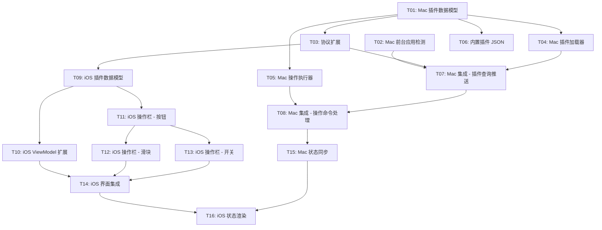

# App Context Actions — 任务拆分

> 本文档将 MVP 需求拆分为 16 个原子任务。每个任务只做一件事，可独立验收。
> 任务按依赖关系排序，必须按顺序执行。

---

## 依赖关系总览

---

## T01: Mac端 — 插件 Manifest 数据模型

**目标**: 定义插件 JSON 文件对应的 Swift 数据模型，使 Mac 端能解析插件配置。

**新建文件**:
- `AirTapMac/Models/PluginManifest.swift`

**包含类型**:
- `PluginManifest` — 顶层结构 (manifestVersion, plugin, actions)
- `PluginInfo` — 插件元信息 (id, name, version, targetBundleIds, description)
- `ActionItem` — 单个操作项 (id, type, label, icon, config, action, state)
- `ActionItemType` — 操作类型枚举 (button, toggle, slider, segmented)
- `ActionItemConfig` — 配置 (min, max, step, options)
- `SegmentOption` — 分段选项 (id, label, icon)
- `ActionExecution` — 执行定义 (type, keyCode, modifiers, script, command, url, key)
- `ActionExecutionType` — 执行类型枚举 (keyPress, appleScript, shell, openURL, mediaKey)
- `StateQuery` — 状态查询 (type, script)

**不做的事**: 不写加载逻辑，不写执行逻辑，纯数据模型。

**验收标准**:
- [ ] 编译通过
- [ ] 能用 `JSONDecoder` 正确解析技术文档中定义的 Spotify 插件示例 JSON

---

## T02: Mac端 — 前台应用检测 (FrontmostAppMonitor)

**目标**: 创建一个服务类，实时监听 Mac 前台应用切换事件。

**新建文件**:
- `AirTapMac/Services/FrontmostAppMonitor.swift`

**实现要点**:
- 监听 `NSWorkspace.didActivateApplicationNotification`
- 回调 `onAppChanged: ((bundleID: String, appName: String) -> Void)?`
- 仅当 bundleID 与上次不同时才回调（去重）
- 提供 `start()` / `stop()` 方法

**不做的事**: 不与 CommandServer 集成，不发送任何网络消息。

**验收标准**:
- [ ] 编译通过
- [ ] 在 Mac 上切换应用时，控制台能打印出 bundleID 和应用名
- [ ] 快速切换同一应用不会重复触发回调

---

## T03: 协议扩展 — RemoteProtocol (两侧)

**目标**: 扩展 iPhone ↔ Mac 通信协议，新增插件相关的命令和响应类型。

**修改文件**:
- `AirTap/Shared/RemoteProtocol.swift` (iOS 侧)
- `AirTapMac/Shared/RemoteProtocol.swift` (Mac 侧)

**新增内容**:

RemoteCommand 新增 case:
- `pluginAction(pluginID: String, actionID: String, value: ActionValue?)`

RemoteResponse 新增 case:
- `pluginActions(PluginActionPayload?)`
- `pluginStateUpdate(pluginID: String, updates: [ActionStateUpdate])`

新增共享类型:
- `ActionValue` — 枚举 (double, bool, string)
- `PluginActionPayload` — 插件操作负载 (pluginID, pluginName, items)
- `PluginActionItem` — 操作项 (id, type, label, icon, config, state)，用于网络传输
- `PluginActionItemType` — 操作类型枚举
- `PluginActionItemConfig` — 配置
- `ActionStateUpdate` — 状态更新 (actionID, doubleValue, boolValue, stringValue)

**注意**: 两侧文件内容需保持一致。iOS 侧的类型需加 Sendable（与 Mac 侧已有的 pattern 一致）。

**不做的事**: 不修改 CommandServer，不修改 ViewModel。

**验收标准**:
- [ ] iOS 和 Mac 两个 target 都编译通过
- [ ] 现有功能不受影响（新增 case 不破坏已有的编解码）

---

## T04: Mac端 — 插件加载器 (PluginManager)

**目标**: 创建插件管理器，从文件系统加载 JSON 插件并按 bundleID 索引。

**新建文件**:
- `AirTapMac/Services/PluginManager.swift`

**实现要点**:
- 扫描两个来源：
  - 内置插件：App Bundle 内 `Resources/Plugins/` 目录
  - 用户插件：`~/Library/Application Support/AirTap/Plugins/` 目录
- 启动时自动创建用户插件目录（如不存在）
- 用 `JSONDecoder` 解析每个 `.json` 文件为 `PluginManifest`
- 按 `targetBundleIds` 建立索引：`[String: [PluginManifest]]`
- 提供查询方法：`func plugins(for bundleID: String) -> [PluginManifest]`
- 解析失败时跳过该文件，打印错误日志，不崩溃

**依赖**: T01 (PluginManifest 模型)

**不做的事**: 不做热加载，不与 CommandServer 集成。

**验收标准**:
- [ ] 编译通过
- [ ] 能正确加载内置插件目录中的 JSON 文件
- [ ] 能按 bundleID 查询到对应的插件
- [ ] 格式错误的 JSON 不会导致崩溃

---

## T05: Mac端 — 操作执行器 (ActionExecutor)

**目标**: 创建一个执行器，根据 `ActionExecution` 定义执行具体操作。

**新建文件**:
- `AirTapMac/Services/ActionExecutor.swift`

**实现要点**:

支持 5 种执行类型：

| type | 实现方式 |
|------|----------|
| `keyPress` | 调用 `InputSimulator.keyPress(keyCode:modifiers:)`，modifiers 字符串数组转 `CGEventFlags` |
| `appleScript` | `NSAppleScript(source:).executeAndReturnError()`，支持 `{value}` 占位符替换 |
| `shell` | `Process` + `/bin/bash -c`，异步执行 |
| `openURL` | `NSWorkspace.shared.open(URL)` |
| `mediaKey` | 调用 `InputSimulator` 的 media key 方法，支持 playPause / volumeUp / volumeDown / nextTrack / previousTrack |

- 接口：`func execute(_ action: ActionExecution, value: ActionValue?, using simulator: InputSimulator)`

**依赖**: T01 (ActionExecution 模型)

**不做的事**: 不与 CommandServer 集成。

**验收标准**:
- [ ] 编译通过
- [ ] keyPress 类型：能正确模拟 Cmd+C 等快捷键
- [ ] appleScript 类型：能执行简单脚本
- [ ] mediaKey 类型：能触发播放/暂停

---

## T06: 内置插件 — 3 个 JSON 文件

**目标**: 创建 3 个内置插件 JSON 文件，作为开发者参考示例。

**新建文件**:
- `AirTapMac/Resources/Plugins/finder.json`
- `AirTapMac/Resources/Plugins/safari.json`
- `AirTapMac/Resources/Plugins/music.json`

**Finder 插件操作**:
- 新建 Finder 窗口 (Cmd+N)
- 新建文件夹 (Cmd+Shift+N)
- 显示简介 (Cmd+I)
- 删除 (Cmd+Delete)

**Safari 插件操作**:
- 新标签页 (Cmd+T)
- 关闭标签页 (Cmd+W)
- 刷新 (Cmd+R)
- 后退 (Cmd+[)
- 前进 (Cmd+])

**Music 插件操作**:
- 上一首 (mediaKey: previousTrack)
- 播放/暂停 (mediaKey: playPause)
- 下一首 (mediaKey: nextTrack)
- 音量滑块 (appleScript, slider 类型)

**依赖**: T01 (Manifest 格式定义)

**不做的事**: 不写加载逻辑（T04 负责）。

**验收标准**:
- [ ] 3 个 JSON 文件格式正确，能被 `JSONDecoder` 解析为 `PluginManifest`
- [ ] 每个插件的 `targetBundleIds` 正确对应目标 App

---

## T07: Mac端集成 — 前台应用检测 + 插件查询推送

**目标**: 在 CommandServer 中集成 FrontmostAppMonitor 和 PluginManager，当前台 App 切换时自动向 iPhone 推送该 App 的插件操作。

**修改文件**:
- `AirTapMac/Services/CommandServer.swift`

**实现要点**:
- CommandServer 持有 `FrontmostAppMonitor` 和 `PluginManager` 实例
- 启动时初始化并启动 FrontmostAppMonitor
- FrontmostAppMonitor 回调时：
  1. 通过 PluginManager 查询该 bundleID 的插件
  2. 如果有插件：将多个插件的 actions 合并，构造 `PluginActionPayload`，发送 `pluginActions(payload)` 响应
  3. 如果无插件：发送 `pluginActions(nil)` 响应
- iPhone 连接建立时，立即推送当前前台 App 的插件操作

**依赖**: T02, T03, T04

**不做的事**: 不处理 pluginAction 命令（T08 负责），不做状态同步。

**验收标准**:
- [ ] 编译通过
- [ ] iPhone 连接后，切换 Mac 前台 App，iPhone 能收到 pluginActions 响应
- [ ] 无插件的 App 收到 `pluginActions(nil)`
- [ ] 现有功能（鼠标、键盘、App列表等）不受影响

---

## T08: Mac端集成 — pluginAction 命令处理

**目标**: 在 CommandServer 中处理来自 iPhone 的 `pluginAction` 命令，调用 ActionExecutor 执行操作。

**修改文件**:
- `AirTapMac/Services/CommandServer.swift`

**实现要点**:
- 在 `execute(_ command:)` 方法中新增 `case .pluginAction(let pluginID, let actionID, let value)` 分支
- 通过 PluginManager 查找对应插件和 actionID
- 找到 action 后调用 `ActionExecutor.execute(action, value:, using:)`
- 找不到时打印警告日志

**依赖**: T05, T07

**不做的事**: 不做状态同步。

**验收标准**:
- [ ] 编译通过
- [ ] 从 iPhone 发送 pluginAction 命令后，Mac 端能正确执行对应操作
- [ ] 例如：Finder 前台时点击"新建文件夹"，Mac 上弹出新建文件夹对话框

---

## T09: iOS端 — 插件数据模型

**目标**: 在 iOS 端定义用于 UI 渲染的插件数据模型。

**新建文件**:
- `AirTap/Models/PluginModels.swift`

**说明**: iOS 端需要的模型是协议传输类型的子集，用于 SwiftUI 视图渲染。T03 中已在 RemoteProtocol 中定义了 `PluginActionPayload`、`PluginActionItem` 等类型。本任务确认这些类型在 iOS 端可用于 UI 绑定，如需补充 helper 方法（如图标名映射、默认值等）则在此文件添加。

**依赖**: T03

**不做的事**: 不写 UI 代码。

**验收标准**:
- [ ] iOS target 编译通过
- [ ] 模型类型支持 SwiftUI 列表渲染（Identifiable, Hashable 等）

---

## T10: iOS端 — RemoteViewModel 扩展

**目标**: 在 RemoteViewModel 中处理插件相关的新响应类型。

**修改文件**:
- `AirTap/ViewModels/RemoteViewModel.swift`
- `AirTap/Services/ConnectionManager.swift`（如需处理新的 response case）

**实现要点**:
- 新增 `@Published var currentPluginActions: PluginActionPayload?`
- 在 ConnectionManager 处理 `pluginActions` 响应，更新 ViewModel
- 在 ConnectionManager 处理 `pluginStateUpdate` 响应，更新对应 action 的状态
- 新增 `func sendPluginAction(pluginID:actionID:value:)` 方法

**依赖**: T03, T09

**不做的事**: 不写 UI 代码。

**验收标准**:
- [ ] 编译通过
- [ ] 连接 Mac 后，切换前台 App，`currentPluginActions` 正确更新
- [ ] 调用 `sendPluginAction` 能发送 `pluginAction` 命令

---

## T11: iOS端 — ActionBarView (按钮支持)

**目标**: 创建 Touch Bar 风格的操作栏视图，首先只支持 button 类型。

**新建文件**:
- `AirTap/Views/ActionBarView.swift`

**实现要点**:
- 水平滚动的 `ScrollView(.horizontal)`
- 复用现有的视觉风格：`.glassCapsule()` 背景、`.ultraThinMaterial`
- 每个 button 显示 SF Symbol 图标 + 标签文字
- 点击时调用 `onAction: (String, String, ActionValue?) -> Void` 回调（pluginID, actionID, value）
- 左侧显示插件名称（如 "Spotify"）

**依赖**: T09

**不做的事**: 不支持 slider、toggle、segmented（分别在 T12、T13 中添加）。不集成到 ContentView。

**验收标准**:
- [ ] 编译通过
- [ ] SwiftUI Preview 能正确渲染按钮列表
- [ ] 按钮点击触发回调，传入正确的 actionID

---

## T12: iOS端 — ActionBarView 增加滑块 (slider) 支持

**目标**: 在 ActionBarView 中支持 slider 类型的操作项。

**修改文件**:
- `AirTap/Views/ActionBarView.swift`

**实现要点**:
- 当 `item.type == .slider` 时，渲染内联 `Slider` 控件
- 显示图标 + 当前值
- 读取 `config.min`、`config.max`、`config.step` 配置
- 拖动时调用 `onAction` 回调，value 为 `.double(currentValue)`
- 做节流处理：100ms 内只回调最后一次值

**依赖**: T11

**不做的事**: 不处理状态回传（T16 负责）。

**验收标准**:
- [ ] 编译通过
- [ ] SwiftUI Preview 能正确渲染滑块
- [ ] 拖动滑块触发回调，传入正确的 double 值

---

## T13: iOS端 — ActionBarView 增加开关 (toggle) 支持

**目标**: 在 ActionBarView 中支持 toggle 类型的操作项。

**修改文件**:
- `AirTap/Views/ActionBarView.swift`

**实现要点**:
- 当 `item.type == .toggle` 时，渲染可切换状态的按钮
- 视觉上通过高亮/暗淡区分 on/off 状态
- 点击时调用 `onAction` 回调，value 为 `.bool(newState)`
- 本地维护 toggle 状态（后续 T16 会用服务端状态覆盖）

**依赖**: T11

**不做的事**: 不处理服务端状态同步（T16 负责）。

**验收标准**:
- [ ] 编译通过
- [ ] SwiftUI Preview 能正确渲染开关按钮
- [ ] 点击切换 on/off 视觉状态，触发回调传入 bool 值

---

## T14: iOS端 — ContentView / TrackpadView 界面集成

**目标**: 将 ActionBarView 集成到触控板界面，替代现有快捷栏。

**修改文件**:
- `AirTap/ContentView.swift`
- `AirTap/Views/TrackpadView.swift`

**实现要点**:
- 当 `viewModel.currentPluginActions != nil` 时：
  - 用 ActionBarView 替代现有的 `portraitShortcutPill` / `landscapeShortcutPill`
  - ActionBarView 的 `onAction` 回调调用 `viewModel.sendPluginAction(...)`
- 当 `viewModel.currentPluginActions == nil` 时：
  - 保持现有的通用快捷栏（复制、粘贴、撤销等）
- 竖屏和横屏都需要适配

**依赖**: T10, T12, T13

**不做的事**: 不做切换动画优化（Should Have，后续迭代）。

**验收标准**:
- [ ] 编译通过
- [ ] 有插件的 App 前台时，触控板显示插件操作栏
- [ ] 无插件的 App 前台时，触控板显示通用快捷栏
- [ ] 点击插件操作栏中的按钮，Mac 端执行对应操作
- [ ] 竖屏和横屏都能正常显示

---

## T15: Mac端 — 状态同步 (轮询推送)

**目标**: Mac 端定时查询插件操作的当前状态（如音量值、shuffle 状态），推送给 iPhone。

**修改文件**:
- `AirTapMac/Services/CommandServer.swift`（或新建 StatePoller 类）

**实现要点**:
- 当有 iPhone 连接且当前有活跃插件时，启动定时器（间隔 1 秒）
- 遍历当前插件的 actions，找出有 `state` 字段的 action
- 对每个有状态查询的 action，执行其 `state.script`（AppleScript）
- 将结果封装为 `pluginStateUpdate` 响应发送给 iPhone
- 当 App 切换或断开连接时，停止轮询
- AppleScript 执行失败时静默忽略，不中断轮询

**依赖**: T08

**不做的事**: 不修改 iOS 端 UI（T16 负责）。

**验收标准**:
- [ ] 编译通过
- [ ] Spotify 前台时，能定时查询音量值并发送给 iPhone
- [ ] App 切换后停止旧的轮询，切换到新 App 的状态轮询
- [ ] AppleScript 执行失败不崩溃

---

## T16: iOS端 — 状态同步渲染

**目标**: iPhone 端接收 Mac 推送的状态更新，更新 ActionBarView 中 slider 和 toggle 的显示状态。

**修改文件**:
- `AirTap/ViewModels/RemoteViewModel.swift`
- `AirTap/Views/ActionBarView.swift`

**实现要点**:
- ViewModel 收到 `pluginStateUpdate` 时，更新 `currentPluginActions` 中对应 action 的状态
- ActionBarView 中 slider 的当前值由服务端状态驱动（而非仅本地拖拽值）
- ActionBarView 中 toggle 的 on/off 状态由服务端状态驱动
- 用户操作（拖拽 slider / 点击 toggle）立即更新本地状态，不等服务端回传

**依赖**: T14, T15

**验收标准**:
- [ ] 编译通过
- [ ] Spotify 插件的音量滑块显示真实音量值
- [ ] 拖动滑块后，下一次状态同步时滑块位置正确更新
- [ ] toggle 状态与 Mac 端一致

---

## 任务执行顺序总结

| 顺序 | 任务 | 侧 | 依赖 |
|------|------|-----|------|
| 1 | T01: 插件 Manifest 数据模型 | Mac | 无 |
| 2 | T02: 前台应用检测 | Mac | 无 |
| 3 | T03: 协议扩展 | 两侧 | T01 |
| 4 | T04: 插件加载器 | Mac | T01 |
| 5 | T05: 操作执行器 | Mac | T01 |
| 6 | T06: 内置插件 JSON | Mac | T01 |
| 7 | T07: Mac 集成 - 插件查询推送 | Mac | T02, T03, T04 |
| 8 | T08: Mac 集成 - 操作命令处理 | Mac | T05, T07 |
| 9 | T09: iOS 插件数据模型 | iOS | T03 |
| 10 | T10: iOS ViewModel 扩展 | iOS | T03, T09 |
| 11 | T11: iOS 操作栏 - 按钮 | iOS | T09 |
| 12 | T12: iOS 操作栏 - 滑块 | iOS | T11 |
| 13 | T13: iOS 操作栏 - 开关 | iOS | T11 |
| 14 | T14: iOS 界面集成 | iOS | T10, T12, T13 |
| 15 | T15: Mac 状态同步 | Mac | T08 |
| 16 | T16: iOS 状态渲染 | iOS | T14, T15 |

> T01 和 T02 无依赖关系，可以并行开发。
> T04、T05、T06 仅依赖 T01，可以在 T03 之后并行开发。
> T12 和 T13 仅依赖 T11，可以并行开发。
