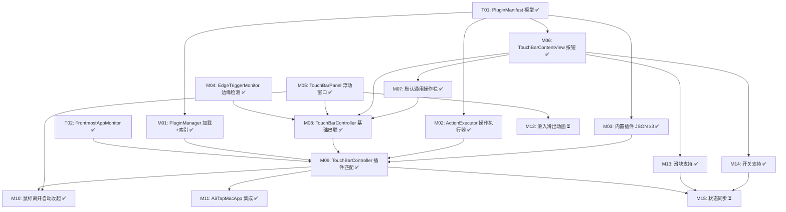

# Mac 原生 Touch Bar — 任务拆分

> 本文档将 Mac 原生 Touch Bar MVP 拆分为 15 个原子任务。每个任务只做一件事，可独立验收。
> 标注 `[已完成]` 的任务已通过验收。

---

## 依赖关系总览

---

## 任务完成状态

| 任务 | 文件 | 状态 |
|------|------|------|
| T01: PluginManifest 数据模型 | `AirTapMac/Models/PluginManifest.swift` | ✅ 已完成 |
| T02: FrontmostAppMonitor | `AirTapMac/Services/FrontmostAppMonitor.swift` | ✅ 已完成 |
| M01: PluginManager 加载+索引 | `AirTapMac/Services/PluginManager.swift` | ✅ 已完成 |
| M02: ActionExecutor 操作执行器 | `AirTapMac/Services/ActionExecutor.swift` | ✅ 已完成 |
| M03: 内置插件 JSON x3 | `AirTapMac/Resources/Plugins/*.json` | ✅ 已完成 |
| M04: EdgeTriggerMonitor 边缘检测 | `AirTapMac/Services/EdgeTriggerMonitor.swift` | ✅ 已完成 |
| M05: TouchBarPanel 浮动窗口 | `AirTapMac/Views/TouchBarPanel.swift` | ✅ 已完成 |
| M06: TouchBarContentView 按钮 | `AirTapMac/Views/TouchBarContentView.swift` | ✅ 已完成 |
| M07: 默认通用操作栏 | `AirTapMac/Models/DefaultActions.swift` | ✅ 已完成 |
| M08: TouchBarController 基础串联 | `AirTapMac/Services/TouchBarController.swift` | ✅ 已完成 |
| M09: TouchBarController 插件匹配 | `AirTapMac/Services/TouchBarController.swift` | ✅ 已完成 |
| M10: 鼠标离开自动收起 | `AirTapMac/Views/TouchBarPanel.swift` | ✅ 已完成 |
| M11: AirTapMacApp 集成 | `AirTapMac/AirTapMacApp.swift` | ✅ 已完成 |
| M12: 滑入滑出动画 | — | ⏳ 待优化（NSAnimationContext 在 HUD 面板上需调试） |
| M13: 滑块支持 | `AirTapMac/Views/TouchBarContentView.swift` | ✅ 已完成 |
| M14: 开关支持 | `AirTapMac/Views/TouchBarContentView.swift` | ✅ 已完成 |
| M15: 状态同步 | `AirTapMac/Services/TouchBarController.swift` | ⏳ 基础轮询已实现，UI 绑定待完善 |

---

## M01: PluginManager — 插件加载与索引

**目标**: 从文件系统加载插件 JSON，按 bundleID 建立索引，提供查询接口。

**新建文件**:
- `AirTapMac/Services/PluginManager.swift`

**实现要点**:
- 扫描两个来源：
  - 内置插件：App Bundle 内的 `Resources/Plugins/` 目录
  - 用户插件：`~/Library/Application Support/AirTap/Plugins/` 目录
- 启动时自动创建用户插件目录（如不存在）
- 用 `JSONDecoder` 解析每个 `.json` 文件为 `PluginManifest`
- 按 `targetBundleIds` 建立索引：`[String: [PluginManifest]]`
- 提供查询方法：`func plugins(for bundleID: String) -> [PluginManifest]`
- 提供合并方法：`func mergedActions(for bundleID: String) -> [ActionItem]`（多插件合并）
- 解析失败时跳过该文件并打印日志，不崩溃

**依赖**: T01

**不做的事**: 不做热加载，不做 UI。

**验收标准**:
- [ ] 编译通过
- [ ] 能加载 JSON 文件并按 bundleID 查询
- [ ] 格式错误的 JSON 不导致崩溃
- [ ] 用户插件目录不存在时自动创建

---

## M02: ActionExecutor — 操作执行器

**目标**: 根据 `ActionExecution` 定义执行具体操作，支持 5 种执行类型。

**新建文件**:
- `AirTapMac/Services/ActionExecutor.swift`

**实现要点**:

| type | 实现方式 |
|------|----------|
| `keyPress` | 复用 `InputSimulator.keyPress()`，将 modifiers 字符串数组（如 `["command", "shift"]`）转为 `CGEventFlags` |
| `appleScript` | `NSAppleScript(source:).executeAndReturnError()`，支持 `{value}` 占位符替换 |
| `shell` | `Process` + `/bin/bash -c`，异步执行，不阻塞主线程 |
| `openURL` | `NSWorkspace.shared.open(URL)` |
| `mediaKey` | 复用 `InputSimulator` 的 media key 方法，映射字符串 key 到方法调用 |

- 接口：`func execute(_ action: ActionExecution, value: Double?, using simulator: InputSimulator)`

**依赖**: T01

**不做的事**: 不集成到任何控制器。

**验收标准**:
- [ ] 编译通过
- [ ] keyPress：能正确模拟 Cmd+C
- [ ] appleScript：能执行简单脚本并替换 `{value}`
- [ ] mediaKey：能触发播放/暂停

---

## M03: 内置插件 — 3 个 JSON 文件

**目标**: 创建 3 个内置插件 JSON 文件，作为开发者参考示例和默认体验。

**新建文件**:
- `AirTapMac/Resources/Plugins/finder.json`
- `AirTapMac/Resources/Plugins/safari.json`
- `AirTapMac/Resources/Plugins/music.json`

**Finder 插件** (`com.apple.finder`):
- 新建 Finder 窗口 (Cmd+N)
- 新建文件夹 (Cmd+Shift+N)
- 显示简介 (Cmd+I)
- 删除 (Cmd+Delete)

**Safari 插件** (`com.apple.Safari`):
- 新标签页 (Cmd+T)
- 关闭标签页 (Cmd+W)
- 刷新 (Cmd+R)
- 后退 (Cmd+[)
- 前进 (Cmd+])

**Music 插件** (`com.apple.Music`):
- 上一首 (mediaKey: previousTrack)
- 播放/暂停 (mediaKey: playPause)
- 下一首 (mediaKey: nextTrack)
- 音量滑块 (slider, appleScript)

**依赖**: T01

**验收标准**:
- [ ] 3 个 JSON 文件能被 `JSONDecoder` 正确解析
- [ ] 每个插件的 `targetBundleIds` 对应正确的系统 App

---

## M04: EdgeTriggerMonitor — 底部边缘检测

**目标**: 监听鼠标位置，当鼠标移到屏幕最底部边缘并停留 150ms 时触发回调。

**新建文件**:
- `AirTapMac/Services/EdgeTriggerMonitor.swift`

**实现要点**:
- 使用 `CGEvent.tapCreate` 全局事件监听鼠标移动，或使用 `NSEvent.addGlobalMonitorForEvents(matching: .mouseMoved)`
- 定义底部热区：屏幕最底部 2px 区域
- 状态机：
  - `idle` → 鼠标进入热区 → `detecting`
  - `detecting` → 停留 150ms → 触发 `onTrigger` 回调
  - `detecting` → 鼠标离开热区 → `idle`（取消计时）
- 回调：`onTrigger: (() -> Void)?`
- 提供 `start()` / `stop()` / `isEnabled` 控制

**依赖**: 无

**不做的事**: 不负责"鼠标离开 Touch Bar 后收起"（M10 负责）。

**验收标准**:
- [ ] 编译通过
- [ ] 鼠标移到屏幕最底部并停留，触发回调
- [ ] 快速划过底部不触发（150ms 防抖生效）
- [ ] 鼠标进入热区后离开，计时器正确取消

---

## M05: TouchBarPanel — 浮动面板窗口

**目标**: 创建一个 NSPanel 浮动窗口，作为 Touch Bar 的容器。定位在 Dock 上方居中。

**新建文件**:
- `AirTapMac/Views/TouchBarPanel.swift`

**实现要点**:
- 继承 `NSPanel`，设置为：
  - `.nonactivatingPanel`（不抢焦点）
  - `.styleMask` 包含 `.borderless` + `.nonactivatingPanel`
  - `level` = `.floating`（或 `.dock + 1`，确保在 Dock 上方）
  - `isMovableByWindowBackground = false`
  - `hidesOnDeactivate = false`
  - `backgroundColor = .clear`
- 使用 `NSVisualEffectView` 实现毛玻璃背景
- 圆角 12pt
- 尺寸：高度 52pt，宽度根据内容或固定一个合理值
- 定位：屏幕底部居中，Dock 上方 12pt
- 提供 `showBar()` / `hideBar()` 方法（MVP 先无动画，M12 加动画）
- 使用 `NSHostingView` 承载 SwiftUI 内容

**依赖**: 无

**不做的事**: 不写 SwiftUI 内容（M06 负责），不做动画（M12 负责），不做自动收起（M10 负责）。

**验收标准**:
- [ ] 编译通过
- [ ] 调用 `showBar()` 时面板出现在 Dock 上方居中位置
- [ ] 毛玻璃 + 圆角效果正确
- [ ] 不抢夺当前窗口焦点（点击其他窗口不会被 Touch Bar 挡住焦点）
- [ ] 调用 `hideBar()` 时面板消失

---

## M06: TouchBarContentView — 按钮布局

**目标**: 创建 Touch Bar 的 SwiftUI 内容视图，支持 button 类型的操作项渲染。

**新建文件**:
- `AirTapMac/Views/TouchBarContentView.swift`

**实现要点**:
- 接收参数：`appName: String`、`items: [ActionItem]`、`onAction: (ActionItem) -> Void`
- 水平 HStack 布局：
  - 左侧：App 名称标签（小字，半透明）
  - 分割线
  - 操作按钮列表（图标 + 标签）
- 按钮样式：
  - SF Symbol 图标 (`Image(systemName:)`)
  - 标签文字（小字）
  - 圆角矩形背景
  - hover 高亮效果（`.onHover`）
  - 点击时调用 `onAction` 回调
- 当 `item.type == .button` 时渲染按钮，其他类型暂时跳过

**依赖**: T01 (ActionItem 模型)

**不做的事**: 不支持 slider/toggle（M13、M14 负责），不嵌入 Panel（M08 负责）。

**验收标准**:
- [ ] 编译通过
- [ ] SwiftUI Preview 能正确渲染一组按钮
- [ ] 按钮显示图标 + 标签
- [ ] hover 时有高亮效果
- [ ] 点击触发回调

---

## M07: 默认通用操作栏

**目标**: 定义无插件时显示的通用快捷操作列表。

**新建文件**:
- `AirTapMac/Models/DefaultActions.swift`

**实现要点**:
- 定义一个静态方法或属性，返回 `[ActionItem]` 数组
- 包含通用操作：
  - 复制 (Cmd+C)
  - 粘贴 (Cmd+V)
  - 撤销 (Cmd+Z)
  - 全选 (Cmd+A)
  - 关闭 (Cmd+W)
  - 音量减 (mediaKey)
  - 音量加 (mediaKey)
  - 播放/暂停 (mediaKey)
- 每个操作使用 `ActionItem` 格式（和插件操作同构）

**依赖**: T01, M06

**不做的事**: 不做 UI（复用 M06 的 TouchBarContentView）。

**验收标准**:
- [ ] 编译通过
- [ ] 返回的 `[ActionItem]` 数组格式正确
- [ ] 用 TouchBarContentView 渲染时能正确显示所有默认操作

---

## M08: TouchBarController — 基础串联

**目标**: 创建控制器，将 EdgeTriggerMonitor 和 TouchBarPanel 串联，实现"鼠标移到底部 → 显示 Touch Bar（默认操作栏）"的最小闭环。

**新建文件**:
- `AirTapMac/Services/TouchBarController.swift`

**实现要点**:
- 持有 `EdgeTriggerMonitor`、`TouchBarPanel` 实例
- EdgeTriggerMonitor 触发时：
  1. 用 DefaultActions 获取默认操作列表
  2. 设置 TouchBarPanel 的 SwiftUI 内容为 TouchBarContentView
  3. 调用 `panel.showBar()`
- onAction 回调中暂时只 `print` 操作 ID（ActionExecutor 在 M09 集成）
- 提供 `start()` / `stop()` / `isEnabled` 控制

**依赖**: M04, M05, M06, M07

**不做的事**: 不集成 PluginManager（M09 负责），不集成 ActionExecutor（M09 负责），不做自动收起（M10 负责）。

**验收标准**:
- [ ] 编译通过
- [ ] 鼠标移到屏幕底部 → Touch Bar 弹出，显示默认操作按钮
- [ ] 点击按钮在控制台打印操作 ID

---

## M09: TouchBarController — 插件匹配 + 操作执行

**目标**: 在 TouchBarController 中集成 FrontmostAppMonitor、PluginManager、ActionExecutor，实现"检测前台 App → 查找插件 → 显示对应操作 → 点击执行"的完整链路。

**修改文件**:
- `AirTapMac/Services/TouchBarController.swift`

**实现要点**:
- 新增持有 `FrontmostAppMonitor`、`PluginManager`、`ActionExecutor`、`InputSimulator` 实例
- FrontmostAppMonitor 回调时记录当前 bundleID
- EdgeTriggerMonitor 触发时：
  1. 通过 PluginManager 查询当前 bundleID 的插件
  2. 有插件：合并操作列表，显示插件操作栏
  3. 无插件：显示默认操作栏
- onAction 回调中调用 `ActionExecutor.execute()`
- Touch Bar 可见时，App 切换自动更新内容

**依赖**: T02, M01, M02, M03, M08

**验收标准**:
- [ ] 编译通过
- [ ] Finder 前台 → Touch Bar 显示 Finder 插件操作
- [ ] 切换到无插件 App → Touch Bar 显示默认操作
- [ ] 点击按钮 → Mac 执行对应操作（如 Cmd+N 打开新 Finder 窗口）
- [ ] Music 前台 → 点击播放暂停 → 音乐播放/暂停

---

## M10: 鼠标离开自动收起

**目标**: 鼠标移出 Touch Bar 区域后延迟 300ms 自动收起，鼠标重新进入则取消收起。

**修改文件**:
- `AirTapMac/Views/TouchBarPanel.swift`（或 `TouchBarController.swift`）

**实现要点**:
- 使用 `NSTrackingArea` 或全局鼠标事件监听，检测鼠标是否在 Touch Bar 面板区域内
- 鼠标离开面板区域：启动 300ms 延迟定时器
- 定时器到期：调用 `hideBar()`
- 鼠标重新进入面板区域：取消定时器
- 鼠标从面板区域直接移到底部热区（再次触发）：也取消收起

**依赖**: M05, M09

**验收标准**:
- [ ] 鼠标离开 Touch Bar 后 300ms 自动收起
- [ ] 鼠标离开后又快速回来，Touch Bar 不会收起
- [ ] 反复进出不会导致闪烁或状态错乱

---

## M11: AirTapMacApp 集成 + 菜单栏开关

**目标**: 将 TouchBarController 集成到 AirTapMacApp 生命周期中，并在菜单栏添加 Touch Bar 开关。

**修改文件**:
- `AirTapMac/AirTapMacApp.swift`

**实现要点**:
- 在 App 启动时创建并启动 `TouchBarController`
- 在 `StatusMenuView` 中新增：
  - Touch Bar 开关（Toggle）
  - 开关状态控制 `TouchBarController.isEnabled`
- 关闭 Touch Bar 时，如果面板可见则立即隐藏
- 不影响现有 iPhone 远程控制功能（CommandServer 保持不变）

**依赖**: M09

**验收标准**:
- [ ] 编译通过
- [ ] App 启动后 Touch Bar 功能默认开启
- [ ] 菜单栏可以切换 Touch Bar 开/关
- [ ] 关闭后鼠标移到底部不再触发
- [ ] 现有 iPhone 连接功能不受影响

---

## M12: 滑入/滑出动画

**目标**: Touch Bar 弹出和收起时有平滑的滑入滑出动画。

**修改文件**:
- `AirTapMac/Views/TouchBarPanel.swift`

**实现要点**:
- `showBar()`：面板从屏幕底部下方滑入到目标位置，持续 200ms，使用 ease-out 曲线
- `hideBar()`：面板从当前位置滑出到屏幕底部下方，持续 150ms，使用 ease-in 曲线
- 使用 `NSAnimationContext` 或 `animator()` 实现窗口位置动画
- 动画期间禁止重复触发 show/hide

**依赖**: M05

**验收标准**:
- [ ] 弹出时有平滑滑入效果
- [ ] 收起时有平滑滑出效果
- [ ] 快速连续触发不会导致动画错乱

---

## M13: TouchBarContentView — 滑块 (slider) 支持

**目标**: 在 TouchBarContentView 中支持 slider 类型的操作项。

**修改文件**:
- `AirTapMac/Views/TouchBarContentView.swift`

**实现要点**:
- 当 `item.type == .slider` 时，渲染一个内联 `Slider` 控件
- 读取 `config.min`、`config.max`、`config.step`
- 左侧显示图标，右侧显示当前值
- 拖动时调用 `onAction`，传入当前值
- 做节流处理：100ms 内只回调最后一次
- 宽度约 120-150pt

**依赖**: M06

**验收标准**:
- [ ] 编译通过
- [ ] SwiftUI Preview 中滑块正确渲染
- [ ] 拖动滑块能触发回调
- [ ] 节流生效

---

## M14: TouchBarContentView — 开关 (toggle) 支持

**目标**: 在 TouchBarContentView 中支持 toggle 类型的操作项。

**修改文件**:
- `AirTapMac/Views/TouchBarContentView.swift`

**实现要点**:
- 当 `item.type == .toggle` 时，渲染一个可切换状态的按钮
- 视觉区分 on/off：on 状态按钮高亮（如蓝色背景），off 状态暗淡
- 点击切换本地状态，同时触发 `onAction`
- 本地维护 toggle 状态字典（后续 M15 会用服务端状态覆盖）

**依赖**: M06

**验收标准**:
- [ ] 编译通过
- [ ] SwiftUI Preview 中 toggle 按钮正确渲染
- [ ] 点击切换 on/off 视觉状态
- [ ] 点击触发回调

---

## M15: 状态同步 (AppleScript 轮询)

**目标**: 对有 `state` 字段的操作项，定时通过 AppleScript 查询当前值，更新 slider 和 toggle 的显示状态。

**修改文件**:
- `AirTapMac/Services/TouchBarController.swift`
- `AirTapMac/Views/TouchBarContentView.swift`

**实现要点**:
- TouchBarController 中：
  - 当 Touch Bar 可见且有 state 查询的 action 时，启动 1 秒轮询定时器
  - 对每个有 `state` 字段的 action，执行其 AppleScript
  - 将结果传递给 TouchBarContentView 更新显示
  - Touch Bar 隐藏或 App 切换时停止轮询
- TouchBarContentView 中：
  - 接收外部状态更新字典 `[String: Any]`（actionID → value）
  - slider 根据状态更新当前值
  - toggle 根据状态更新 on/off
- AppleScript 执行失败时静默忽略

**依赖**: M09, M13, M14

**验收标准**:
- [ ] Music 插件的音量滑块显示真实系统音量
- [ ] 拖动滑块后，下次轮询时滑块位置正确
- [ ] Touch Bar 隐藏后轮询自动停止
- [ ] AppleScript 执行失败不崩溃

---

## 任务执行顺序总结

| 顺序 | 任务 | 描述 | 依赖 |
|------|------|------|------|
| - | T01 | PluginManifest 模型 | 已完成 |
| - | T02 | FrontmostAppMonitor | 已完成 |
| 1 | M01 | PluginManager 加载+索引 | T01 |
| 2 | M02 | ActionExecutor 操作执行器 | T01 |
| 3 | M03 | 内置插件 JSON x3 | T01 |
| 4 | M04 | EdgeTriggerMonitor 边缘检测 | 无 |
| 5 | M05 | TouchBarPanel 浮动窗口 | 无 |
| 6 | M06 | TouchBarContentView 按钮 | T01 |
| 7 | M07 | 默认通用操作栏 | T01, M06 |
| 8 | M08 | TouchBarController 基础串联 | M04, M05, M06, M07 |
| 9 | M09 | TouchBarController 插件匹配+执行 | T02, M01, M02, M03, M08 |
| 10 | M10 | 鼠标离开自动收起 | M05, M09 |
| 11 | M11 | AirTapMacApp 集成+菜单栏 | M09 |
| 12 | M12 | 滑入滑出动画 | M05 |
| 13 | M13 | 滑块支持 | M06 |
| 14 | M14 | 开关支持 | M06 |
| 15 | M15 | 状态同步 | M09, M13, M14 |

> **可并行的任务组**:
> - M01、M02、M03 仅依赖 T01，可并行开发
> - M04、M05、M06 相互无依赖，可并行开发
> - M12 可在 M05 之后任何时候做
> - M13、M14 可并行开发
