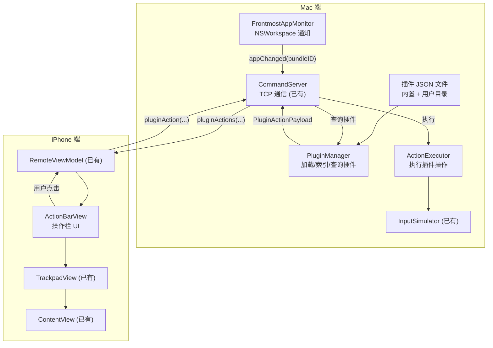

# App Context Actions — 技术文档

## 技术方案概述

在现有 AirTap 架构（iPhone ↔ Mac TCP 通信）基础上，新增以下能力：

1. **Mac 端**：检测前台应用切换，加载/管理静态插件，执行插件操作
2. **协议层**：扩展 RemoteCommand / RemoteResponse，支持插件操作的传输
3. **iPhone 端**：新增 ActionBarView 操作栏，替代现有快捷栏

不引入新的通信通道，复用现有的 TCP 连接。

---

## 架构设计



---

## 数据模型 / 协议定义

### 插件 Manifest JSON 格式

```json
{
  "manifestVersion": 1,
  "plugin": {
    "id": "com.airtap.spotify",
    "name": "Spotify",
    "version": "1.0.0",
    "targetBundleIds": ["com.spotify.client"],
    "description": "Spotify 播放控制"
  },
  "actions": [
    {
      "id": "play_pause",
      "type": "button",
      "label": "播放/暂停",
      "icon": "playpause.fill",
      "action": {
        "type": "mediaKey",
        "key": "playPause"
      }
    },
    {
      "id": "volume",
      "type": "slider",
      "label": "音量",
      "icon": "speaker.wave.2.fill",
      "config": {
        "min": 0,
        "max": 100,
        "step": 5
      },
      "action": {
        "type": "appleScript",
        "script": "tell application \"Spotify\" to set sound volume to {value}"
      },
      "state": {
        "type": "appleScript",
        "script": "tell application \"Spotify\" to get sound volume"
      }
    },
    {
      "id": "shuffle",
      "type": "toggle",
      "label": "随机",
      "icon": "shuffle",
      "action": {
        "type": "appleScript",
        "script": "tell application \"Spotify\" to set shuffling to (not shuffling)"
      },
      "state": {
        "type": "appleScript",
        "script": "tell application \"Spotify\" to get shuffling"
      }
    }
  ]
}
```

### Swift 数据模型 (新增)

```swift
// MARK: - Plugin Manifest Model

struct PluginManifest: Codable {
    let manifestVersion: Int
    let plugin: PluginInfo
    let actions: [ActionItem]
}

struct PluginInfo: Codable {
    let id: String
    let name: String
    let version: String
    let targetBundleIds: [String]
    let description: String?
}

struct ActionItem: Codable, Identifiable {
    let id: String
    let type: ActionItemType
    let label: String
    let icon: String?
    let config: ActionItemConfig?
    let action: ActionExecution
    let state: StateQuery?
}

enum ActionItemType: String, Codable {
    case button
    case toggle
    case slider
    case segmented
}

struct ActionItemConfig: Codable {
    let min: Double?
    let max: Double?
    let step: Double?
    let options: [SegmentOption]?
}

struct SegmentOption: Codable {
    let id: String
    let label: String
    let icon: String?
}

struct ActionExecution: Codable {
    let type: ActionExecutionType
    let keyCode: Int?
    let modifiers: [String]?
    let script: String?
    let command: String?
    let url: String?
    let key: String?
}

enum ActionExecutionType: String, Codable {
    case keyPress
    case appleScript
    case shell
    case openURL
    case mediaKey
}

struct StateQuery: Codable {
    let type: String       // "appleScript"
    let script: String
}
```

### 协议扩展 (RemoteProtocol.swift)

```swift
// iOS → Mac (新增 case)
enum RemoteCommand: Codable {
    // ... 现有 case ...
    case pluginAction(pluginID: String, actionID: String, value: ActionValue?)
}

// Mac → iOS (新增 case)
enum RemoteResponse: Codable {
    // ... 现有 case ...
    case pluginActions(PluginActionPayload?)
    case pluginStateUpdate(pluginID: String, updates: [ActionStateUpdate])
}

// 新增类型
enum ActionValue: Codable {
    case double(Double)
    case bool(Bool)
    case string(String)
}

struct PluginActionPayload: Codable {
    let pluginID: String
    let pluginName: String
    let items: [ActionItem]
}

struct ActionStateUpdate: Codable {
    let actionID: String
    let doubleValue: Double?
    let boolValue: Bool?
    let stringValue: String?
}
```

---

## 文件变更清单

### 新建文件

| 文件路径 | 职责 |
|----------|------|
| `AirTapMac/Services/FrontmostAppMonitor.swift` | 使用 NSWorkspace 通知检测前台应用切换 |
| `AirTapMac/Services/PluginManager.swift` | 加载、索引、查询静态插件 |
| `AirTapMac/Services/ActionExecutor.swift` | 根据 ActionExecution 类型执行操作 |
| `AirTapMac/Models/PluginManifest.swift` | 插件 Manifest 数据模型 (Mac 侧) |
| `AirTap/Models/PluginModels.swift` | 插件数据模型 (iOS 侧，用于 UI 渲染) |
| `AirTap/Views/ActionBarView.swift` | Touch Bar 风格操作栏 UI |
| `AirTapMac/Resources/Plugins/finder.json` | 内置 Finder 插件 |
| `AirTapMac/Resources/Plugins/safari.json` | 内置 Safari 插件 |
| `AirTapMac/Resources/Plugins/music.json` | 内置 Music 插件 |

### 修改文件

| 文件路径 | 改动内容 |
|----------|----------|
| `AirTap/Shared/RemoteProtocol.swift` | 新增 `pluginAction` command、`pluginActions`/`pluginStateUpdate` response、相关类型 |
| `AirTapMac/Shared/RemoteProtocol.swift` | 同上 (Mac 侧副本) |
| `AirTapMac/Services/CommandServer.swift` | 集成 FrontmostAppMonitor 和 PluginManager；处理 pluginAction 命令；App 切换时发送 pluginActions |
| `AirTap/ViewModels/RemoteViewModel.swift` | 新增 `@Published var currentPluginActions`；处理 pluginActions 和 pluginStateUpdate 响应 |
| `AirTap/Views/TrackpadView.swift` | 在触控板上方嵌入 ActionBarView |
| `AirTap/ContentView.swift` | 有 pluginActions 时用 ActionBarView 替代 shortcutPill；保留无插件时的回退逻辑 |

---

## 分阶段实施计划

### Phase 1: MVP (本次实施)

```mermaid
gantt
    title Phase 1 实施顺序
    dateFormat X
    axisFormat %s

    section Mac端
    FrontmostAppMonitor         :a1, 0, 1
    PluginManifest模型           :a2, 0, 1
    PluginManager               :a3, 1, 2
    ActionExecutor              :a4, 2, 3
    内置插件JSON                 :a5, 2, 3

    section 协议层
    RemoteProtocol扩展           :b1, 1, 2

    section iPhone端
    PluginModels                :c1, 1, 2
    ActionBarView               :c2, 2, 4
    
    section 集成
    CommandServer集成            :d1, 3, 4
    ViewModel集成               :d2, 3, 4
    ContentView适配             :d3, 4, 5
```



**实施步骤:**

1. **基础层** (并行)
   - Mac: `FrontmostAppMonitor` + `PluginManifest` 模型
   - 协议: 两侧 `RemoteProtocol.swift` 扩展

2. **核心逻辑**
   - Mac: `PluginManager` (加载 + 索引)
   - Mac: `ActionExecutor` (执行操作)
   - Mac: 3 个内置插件 JSON
   - iOS: `PluginModels` (UI 渲染用)

3. **UI 层**
   - iOS: `ActionBarView` (支持 button, toggle, slider, segmented)

4. **集成**
   - Mac: `CommandServer` 集成新组件
   - iOS: `RemoteViewModel` 处理新响应
   - iOS: `ContentView` / `TrackpadView` 适配

### Phase 2: 增强体验 (后续)

- 切换动画优化
- 插件热加载 (FileSystem 监听)
- 横屏布局适配
- 插件管理 UI (Mac 端)

### Phase 3: 动态协议 (远期)

- JSON-RPC 2.0 over stdio 协议规范
- DynamicPluginHost 进程管理
- 开发者 SDK (Swift / Python / Node.js)
- CLI 工具 (`airtap-plugin init`)

---

## 风险与待定项

| 风险 | 影响 | 缓解措施 |
|------|------|----------|
| AppleScript 执行可能较慢 | slider 拖动体验不流畅 | 对 slider 做节流 (throttle)，100ms 内只执行最后一次 |
| 插件目录不存在 | 首次运行无法加载用户插件 | 启动时自动创建目录 |
| RemoteProtocol 扩展导致旧版本不兼容 | 旧版 iPhone/Mac 端无法解析新消息 | JSON 解码失败时静默忽略，不影响现有功能 |
| NSWorkspace 通知可能频繁触发 | 网络流量过高 | 只在 bundleID 实际变化时才发送 |
| 状态同步轮询消耗性能 | CPU 和网络开销 | 仅当 iPhone 连接且触控板模式激活时才轮询；间隔 1-2 秒 |

---

## 待定项

- [ ] 用户插件目录路径是否支持自定义
- [ ] 插件图标是否支持自定义颜色
- [ ] 状态同步轮询间隔具体值 (建议 1 秒)
- [ ] 动态协议 (Phase 3) 具体规范
