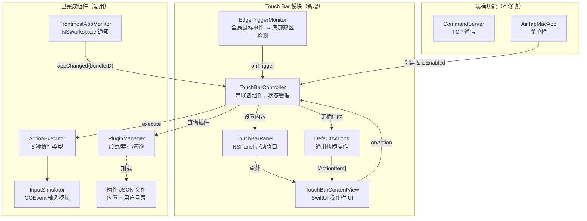
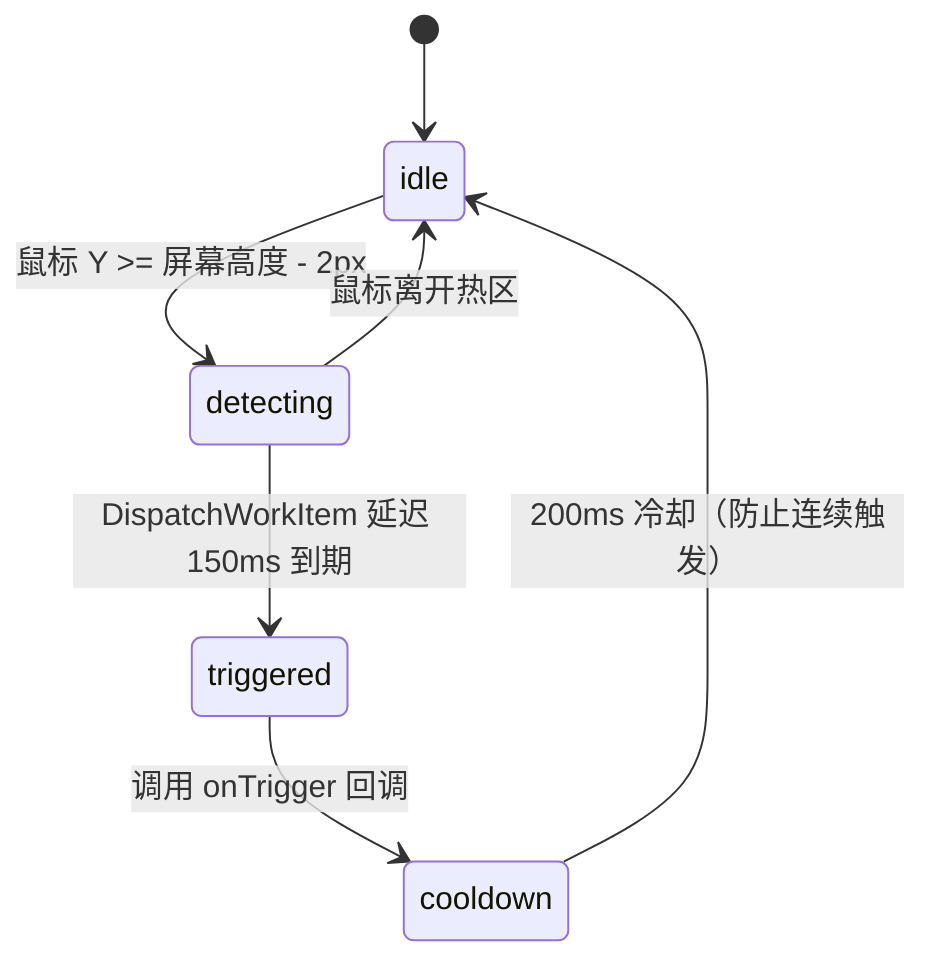
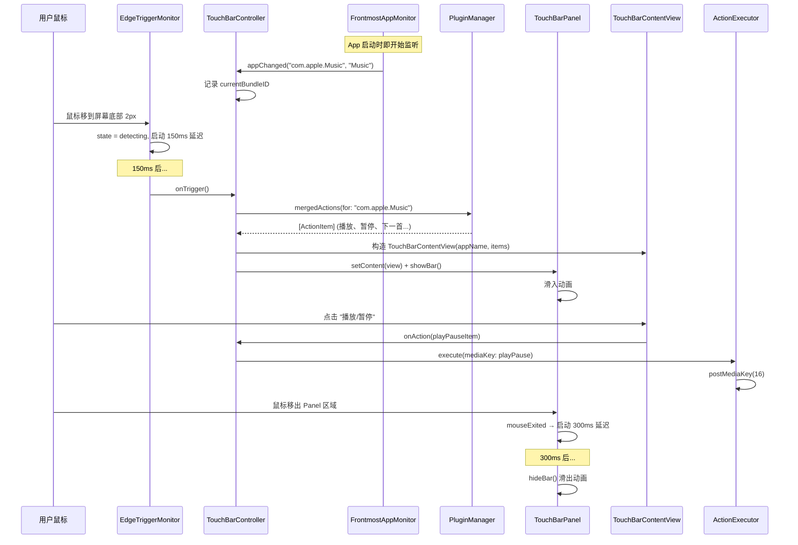
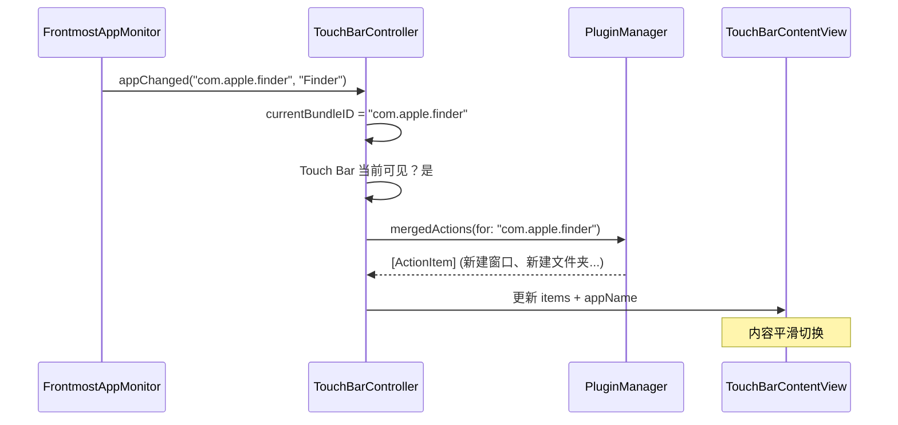

# Mac 原生 Touch Bar — 技术文档

## 技术方案概述

在现有 AirTapMac 架构基础上，新增一个**纯 Mac 端**的浮动操作栏功能：

1. **边缘检测**：监听全局鼠标事件，检测鼠标是否进入屏幕底部热区
2. **浮动面板**：使用 `NSPanel`（`.hudWindow` 样式）+ SwiftUI `.ultraThinMaterial` 实现毛玻璃浮动窗口
3. **内容渲染**：SwiftUI 视图通过 `NSHostingView` 直接作为 `contentView`，渲染插件操作按钮
4. **插件匹配**：复用已完成的 `FrontmostAppMonitor` + `PluginManager` 按前台 App 查询
5. **操作执行**：复用已完成的 `ActionExecutor` + `InputSimulator` 执行操作

不涉及 iPhone 通信，不修改 `RemoteProtocol`，不影响现有远程控制功能。

---

## 架构设计



### 核心设计原则

1. **不抢夺焦点**：`NSPanel` 使用 `.nonactivatingPanel` 样式，用户操作 Touch Bar 不会导致当前窗口失焦
2. **零耦合**：Touch Bar 模块与 `CommandServer`（iPhone 通信）完全独立，通过 `AirTapMacApp` 在同一进程中共存
3. **组件复用**：`PluginManager`、`ActionExecutor`、`FrontmostAppMonitor` 直接实例化使用，无需修改
4. **状态机驱动**：边缘检测使用显式状态机避免竞态

---

## 关键技术方案

### 1. 边缘检测（EdgeTriggerMonitor）

**方案**：使用 `NSEvent.addGlobalMonitorForEvents(matching: .mouseMoved)` 监听全局鼠标移动。

**状态机**：



**实现要点**：

```swift
final class EdgeTriggerMonitor {
    enum State { case idle, detecting, triggered, cooldown }

    private var state: State = .idle
    private var monitor: Any?
    private var delayTask: DispatchWorkItem?
    var onTrigger: (() -> Void)?
    var isEnabled: Bool = true

    func start() {
        monitor = NSEvent.addGlobalMonitorForEvents(matching: .mouseMoved) { [weak self] event in
            self?.handleMouseMove(event)
        }
    }

    private func handleMouseMove(_ event: NSEvent) {
        guard isEnabled else { return }
        let screen = NSScreen.main ?? NSScreen.screens.first!
        let mouseY = NSEvent.mouseLocation.y

        let inHotZone = mouseY <= 2.0  // 屏幕最底部 2px

        switch state {
        case .idle:
            if inHotZone {
                state = .detecting
                scheduleDelay()
            }
        case .detecting:
            if !inHotZone {
                cancelDelay()
                state = .idle
            }
        case .triggered, .cooldown:
            break
        }
    }
}
```

**为什么不用 `CGEvent.tapCreate`**：`NSEvent.addGlobalMonitorForEvents` 更轻量，不需要辅助功能权限即可监听鼠标移动事件，且 API 更简洁。`CGEvent.tapCreate` 适合需要拦截/修改事件的场景。

### 2. 浮动面板（TouchBarPanel）

**方案**：继承 `NSPanel`，使用 `.hudWindow` 样式确保系统正确处理浮动行为，`NSHostingView` 直接作为 `contentView`，SwiftUI 层用 `.ultraThinMaterial` 实现毛玻璃。

> **实现经验**：最初尝试 `NSVisualEffectView` + `NSHostingView` 子视图的方案，但 `NSHostingView` 的默认背景会遮挡毛玻璃效果。改为 `NSHostingView` 直接作为 `contentView`，毛玻璃效果在 SwiftUI 层用 `.background(.ultraThinMaterial)` 实现。
>
> `styleMask` 必须包含 `.hudWindow`，`level` 必须为 `.statusBar` 或更高，否则面板在 `LSUIElement` 应用中不可见。

**关键配置**：

```swift
class TouchBarPanel: NSPanel {
    init() {
        super.init(
            contentRect: .zero,
            styleMask: [.borderless, .nonactivatingPanel, .hudWindow],
            backing: .buffered,
            defer: false
        )
        level = .statusBar
        isMovableByWindowBackground = false
        hidesOnDeactivate = false
        backgroundColor = .clear
        isOpaque = false
        hasShadow = true
        collectionBehavior = [.canJoinAllSpaces, .stationary, .fullScreenAuxiliary]
        isReleasedWhenClosed = false
    }
}
```

**定位计算**：

```
屏幕坐标系（macOS 左下角为原点）：

screenHeight
    │
    │   ┌─ Touch Bar Panel ─┐
    │   └───────────────────┘  ← panelY = dockHeight + margin(12pt)
    │   ┌─── Dock ──────────┐
    │   └───────────────────┘  ← y = 0
────┴───────────────────────── x
```

- 宽度：根据内容自适应，最大不超过 `screenWidth * 0.7`
- 高度：固定 52pt
- X 居中：`(screenWidth - panelWidth) / 2`
- Y 定位：Dock 上方 12pt。通过 `NSScreen.main!.visibleFrame` 获取排除 Dock 和菜单栏后的可用区域，面板 Y 坐标 = `visibleFrame.origin.y - 12 - panelHeight`... 但更简单的做法是直接用固定偏移（如 `y = 80`），因为 Dock 高度因设置而异

**实际定位策略**：使用 `NSScreen.main!.visibleFrame`，面板底部对齐 `visibleFrame.origin.y + 8`（Dock 上方 8pt 间距）。

### 3. 内容渲染（TouchBarContentView）

**方案**：纯 SwiftUI 视图，通过 `NSHostingView` 嵌入 `TouchBarPanel`。

**布局结构**：

```
┌──────────────────────────────────────────────────────────────┐
│  Spotify  │  ◀◀  │  ▶❚❚  │  ▶▶  │  ──●────── 🔊  │  🔀  │
│  (appName)│(btn) │ (btn) │(btn) │   (slider)      │(toggle)│
└──────────────────────────────────────────────────────────────┘
```

- **外层**：`HStack(spacing: 6)`
- **App 标签**：`Text(appName)` 小字半透明 + 竖线分隔
- **按钮**：SF Symbol 图标 + 标签，`.onHover` 高亮
- **滑块**：内联 `Slider`，宽 120pt，拖动节流 100ms
- **开关**：高亮/暗淡按钮样式

### 4. 鼠标离开收起

**方案**：在 `TouchBarPanel` 上使用 `NSTrackingArea` 监听鼠标进出。

```swift
let trackingArea = NSTrackingArea(
    rect: bounds,
    options: [.mouseEnteredAndExited, .activeAlways],
    owner: self
)
contentView?.addTrackingArea(trackingArea)
```

- 鼠标退出 → 启动 300ms `DispatchWorkItem`
- 300ms 内鼠标重新进入 → 取消 WorkItem
- 300ms 到期 → `hideBar()`

### 5. 滑入/滑出动画

**状态**：⏳ 待优化

> **实现经验**：`NSAnimationContext` 的 `animator().setFrameOrigin()` 和 `animator().alphaValue` 在 `.hudWindow` 样式的 `NSPanel` 上均不生效。初始位置设在屏幕外 `y = -height` 后，如果动画未执行，面板会永远停留在不可见位置。
>
> 当前方案：直接 `setFrameOrigin` 到目标位置 + `orderFrontRegardless()`，不做动画。后续需要探索替代方案：
> - `NSWindow.setFrame(_:display:animate:)` 系统内置动画
> - `CAAnimation` 直接操作 window layer
> - `Timer` 手动插值实现动画

### 6. 状态同步（AppleScript 轮询）

当 Touch Bar 可见且当前操作列表中有 `state` 字段的 action 时：

1. 启动 `Timer.scheduledTimer(withTimeInterval: 1.0)` 轮询
2. 遍历有 `state` 的 action，异步执行 AppleScript
3. 解析返回值（数字 → slider、布尔 → toggle）
4. 通过 Binding/ObservableObject 更新 SwiftUI 视图
5. Touch Bar 隐藏或 App 切换时 `invalidate()` 定时器

---

## 数据流

### 完整交互时序



### App 切换时（Touch Bar 可见状态）



---

## 文件变更清单

### 新建文件

| 文件路径 | 职责 | 对应任务 |
|----------|------|----------|
| `AirTapMac/Services/EdgeTriggerMonitor.swift` | 全局鼠标监听 + 底部热区检测状态机 | M04 |
| `AirTapMac/Views/TouchBarPanel.swift` | NSPanel 浮动窗口 + 毛玻璃 + 动画 | M05, M12 |
| `AirTapMac/Views/TouchBarContentView.swift` | SwiftUI 操作栏（button/slider/toggle） | M06, M13, M14 |
| `AirTapMac/Models/DefaultActions.swift` | 无插件时的通用快捷操作列表 | M07 |
| `AirTapMac/Services/TouchBarController.swift` | 串联所有组件的控制器 | M08, M09, M10, M15 |
| `AirTapMac/Resources/Plugins/finder.json` | 内置 Finder 插件 | M03 |
| `AirTapMac/Resources/Plugins/safari.json` | 内置 Safari 插件 | M03 |
| `AirTapMac/Resources/Plugins/music.json` | 内置 Music 插件 | M03 |

### 修改文件

| 文件路径 | 改动内容 | 对应任务 |
|----------|----------|----------|
| `AirTapMac/AirTapMacApp.swift` | 创建 TouchBarController，菜单栏添加 Touch Bar 开关 | M11 |

### 不修改的文件

| 文件路径 | 说明 |
|----------|------|
| `AirTapMac/Models/PluginManifest.swift` | 已完成，直接复用 |
| `AirTapMac/Services/FrontmostAppMonitor.swift` | 已完成，TouchBarController 新建实例使用 |
| `AirTapMac/Services/PluginManager.swift` | 已完成，TouchBarController 新建实例使用 |
| `AirTapMac/Services/ActionExecutor.swift` | 已完成，TouchBarController 新建实例使用 |
| `AirTapMac/Services/InputSimulator.swift` | 已有，ActionExecutor 依赖 |
| `AirTapMac/Services/CommandServer.swift` | 不修改，iPhone 功能独立 |
| `AirTap/*` | 不修改任何 iOS 端文件 |
| `AirTapMac/Shared/RemoteProtocol.swift` | 不修改协议 |

---

## 内置插件 JSON 格式示例

### finder.json

```json
{
  "manifestVersion": 1,
  "plugin": {
    "id": "com.airtap.finder",
    "name": "Finder",
    "version": "1.0.0",
    "targetBundleIds": ["com.apple.finder"],
    "description": "Finder 文件管理快捷操作"
  },
  "actions": [
    {
      "id": "new_window",
      "type": "button",
      "label": "新建窗口",
      "icon": "macwindow.badge.plus",
      "action": { "type": "keyPress", "keyCode": 45, "modifiers": ["command"] }
    },
    {
      "id": "new_folder",
      "type": "button",
      "label": "新建文件夹",
      "icon": "folder.badge.plus",
      "action": { "type": "keyPress", "keyCode": 45, "modifiers": ["command", "shift"] }
    },
    {
      "id": "get_info",
      "type": "button",
      "label": "简介",
      "icon": "info.circle",
      "action": { "type": "keyPress", "keyCode": 34, "modifiers": ["command"] }
    },
    {
      "id": "delete",
      "type": "button",
      "label": "删除",
      "icon": "trash",
      "action": { "type": "keyPress", "keyCode": 51, "modifiers": ["command"] }
    }
  ]
}
```

### music.json（含 slider + state 查询）

```json
{
  "manifestVersion": 1,
  "plugin": {
    "id": "com.airtap.music",
    "name": "Music",
    "version": "1.0.0",
    "targetBundleIds": ["com.apple.Music"],
    "description": "Apple Music 播放控制"
  },
  "actions": [
    {
      "id": "prev_track",
      "type": "button",
      "label": "上一首",
      "icon": "backward.fill",
      "action": { "type": "mediaKey", "key": "previousTrack" }
    },
    {
      "id": "play_pause",
      "type": "button",
      "label": "播放/暂停",
      "icon": "playpause.fill",
      "action": { "type": "mediaKey", "key": "playPause" }
    },
    {
      "id": "next_track",
      "type": "button",
      "label": "下一首",
      "icon": "forward.fill",
      "action": { "type": "mediaKey", "key": "nextTrack" }
    },
    {
      "id": "volume",
      "type": "slider",
      "label": "音量",
      "icon": "speaker.wave.2.fill",
      "config": { "min": 0, "max": 100, "step": 5 },
      "action": {
        "type": "appleScript",
        "script": "set volume output volume {value}"
      },
      "state": {
        "type": "appleScript",
        "script": "output volume of (get volume settings)"
      }
    }
  ]
}
```

---

## 分阶段实施计划

### Phase 1: MVP 最小闭环（M01~M11）

目标：鼠标移到底部 → Touch Bar 弹出 → 显示对应 App 操作 → 点击执行 → 离开收起

```mermaid
gantt
    title Phase 1 实施顺序
    dateFormat X
    axisFormat %s

    section 基础组件（可并行）
    M03 内置插件 JSON x3         :m03, 0, 1
    M04 EdgeTriggerMonitor       :m04, 0, 1
    M05 TouchBarPanel            :m05, 0, 1
    M06 TouchBarContentView 按钮 :m06, 0, 1

    section 默认操作
    M07 DefaultActions           :m07, 1, 2

    section 基础串联
    M08 TouchBarController 基础  :m08, 2, 3

    section 完整链路
    M09 插件匹配 + 执行          :m09, 3, 4
    M10 鼠标离开收起             :m10, 4, 5
    M11 AirTapMacApp 集成        :m11, 5, 6
```



**并行任务组**：
- **Group A**（无依赖）：M03、M04、M05、M06 可同时开发
- **Group B**（依赖 M06）：M07
- **Group C**（依赖 A+B）：M08 → M09 → M10 → M11 串行

### Phase 2: 体验增强（M12~M15）

目标：动画效果、slider/toggle 控件、状态实时同步

```mermaid
gantt
    title Phase 2 实施顺序
    dateFormat X
    axisFormat %s

    section 动画
    M12 滑入滑出动画             :m12, 0, 1

    section 高级控件（可并行）
    M13 滑块支持                 :m13, 0, 1
    M14 开关支持                 :m14, 0, 1

    section 状态同步
    M15 AppleScript 轮询         :m15, 1, 2
```



**并行任务组**：M12、M13、M14 可同时开发

---

## 风险与待定项

| 风险 | 影响 | 缓解措施 |
|------|------|----------|
| Dock 自动隐藏与底部热区冲突 | 用户可能误触 Dock 而非 Touch Bar | MVP 先不处理，M04 开发时真机验证；若冲突可调整热区高度或增加横向偏移检测 |
| `NSEvent.addGlobalMonitorForEvents` 性能 | 每次鼠标移动都会触发回调 | 仅检查 Y 坐标比较，计算量极小；可加节流（如 16ms 一次） |
| `NSPanel` 层级与全屏 App | 全屏模式下 `.floating` 层级可能不显示 | MVP 只支持普通窗口模式；全屏场景需要 `.screenSaver` 层级或 `collectionBehavior` 调整 |
| AppleScript 执行延迟 | slider 拖动时反馈不流畅 | 对 slider 做 100ms 节流；AppleScript 在后台队列异步执行 |
| 多显示器 Dock 位置 | Dock 可能在不同显示器上 | MVP 只支持主显示器（`NSScreen.main`） |
| PluginManager/FrontmostAppMonitor 双实例 | TouchBarController 和未来 CommandServer 各持有一份实例 | 当前 CommandServer 未使用这两个组件；未来如需共享可提取为单例或注入 |

### 待定项

- [ ] Q-1: Dock 自动隐藏冲突 — 真机验证后决定是否需要调整
- [ ] Q-2: 多显示器 — MVP 只做主屏
- [ ] Q-4: Esc 键 — Nice to Have，视 MVP 反馈决定
- [ ] Q-5: 状态同步轮询间隔 — 暂定 1 秒
- [ ] 全屏 App 场景 — 暂不支持，后续迭代
