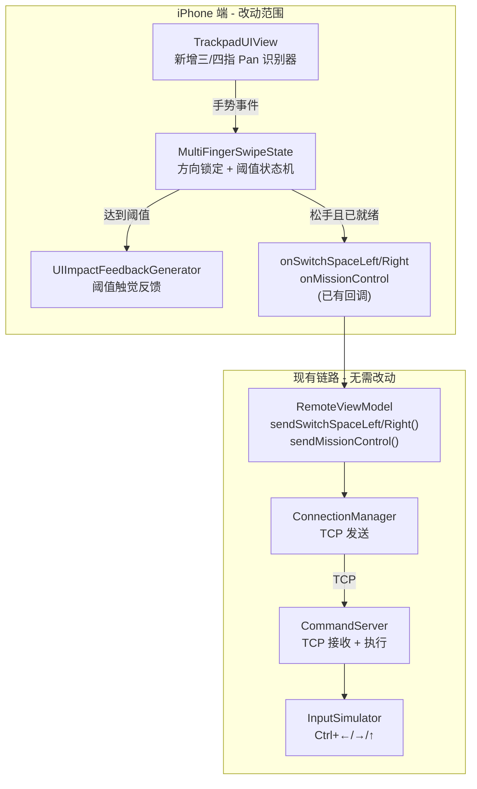
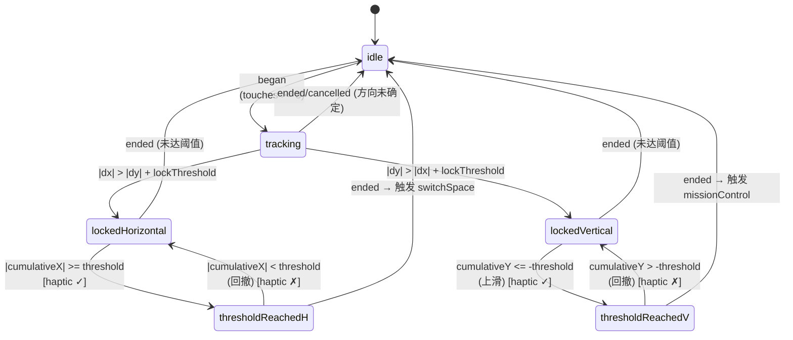

# 多指滑动手势 — 技术文档

## 技术方案概述

在现有 `TrackpadUIView` 手势体系中，新增三指/四指 `UIPanGestureRecognizer`，配合方向锁定和阈值状态机实现「有阻力感」的滑动触发。

核心特点：

- **纯 iOS 端改动**：协议和 Mac 端已完整实现，只需在 iOS 触控板视图中接入手势识别
- **不新增协议命令**：复用已有的 `switchSpaceLeft`、`switchSpaceRight`、`missionControl`
- **阈值 + 状态机**：模拟原生触控板「阻力 → 就绪 → 松手触发」的体验

---

## 架构设计



### 关键设计：状态机



---

## 核心实现方案

### 手势识别器配置

在 `TrackpadUIView.setup()` 中新增一个三指/四指 Pan 手势识别器：

```swift
let multiFingerPan = UIPanGestureRecognizer(target: self, action: #selector(handleMultiFingerPan))
multiFingerPan.minimumNumberOfTouches = 3
multiFingerPan.maximumNumberOfTouches = 4
```

**为什么用一个识别器覆盖 3-4 指，而不是分两个？**

- 三指和四指触发的操作完全相同（与 macOS 原生行为一致）
- 减少识别器冲突
- `minimumNumberOfTouches = 3, maximumNumberOfTouches = 4` 可一次覆盖

### 阈值状态机

```swift
private enum SwipeDirection {
    case undetermined
    case horizontal
    case vertical
}

private struct MultiFingerSwipeState {
    var direction: SwipeDirection = .undetermined
    var cumulativeTranslation: CGPoint = .zero
    var thresholdReached: Bool = false
    
    mutating func reset() {
        direction = .undetermined
        cumulativeTranslation = .zero
        thresholdReached = false
    }
}
```

### 手势处理逻辑

```swift
private let swipeThreshold: CGFloat = 100.0     // 触发阈值（pt）
private let directionLockRatio: CGFloat = 1.5    // 方向锁定比例：主轴位移 > 副轴 * 1.5

@objc private func handleMultiFingerPan(_ g: UIPanGestureRecognizer) {
    switch g.state {
    case .began:
        swipeState.reset()
        
    case .changed:
        let translation = g.translation(in: self)
        swipeState.cumulativeTranslation = translation
        
        // 方向锁定（仅在未确定时）
        if swipeState.direction == .undetermined {
            let absX = abs(translation.x)
            let absY = abs(translation.y)
            let minDisplacement: CGFloat = 15.0
            if absX > minDisplacement || absY > minDisplacement {
                if absX > absY * directionLockRatio {
                    swipeState.direction = .horizontal
                } else if absY > absX * directionLockRatio {
                    swipeState.direction = .vertical
                }
            }
        }
        
        // 阈值检测
        let wasReached = swipeState.thresholdReached
        switch swipeState.direction {
        case .horizontal:
            swipeState.thresholdReached = abs(translation.x) >= swipeThreshold
        case .vertical:
            swipeState.thresholdReached = translation.y <= -swipeThreshold  // 仅上滑
        case .undetermined:
            break
        }
        
        // 触觉反馈：阈值边界穿越时
        if swipeState.thresholdReached != wasReached {
            if swipeState.thresholdReached {
                mediumImpact.impactOccurred()     // 进入就绪
            } else {
                lightImpact.impactOccurred()      // 回撤取消
            }
        }
        
    case .ended, .cancelled:
        if g.state == .ended && swipeState.thresholdReached {
            switch swipeState.direction {
            case .horizontal:
                if swipeState.cumulativeTranslation.x < 0 {
                    heavyImpact.impactOccurred()
                    onSwitchSpaceLeft?()
                } else {
                    heavyImpact.impactOccurred()
                    onSwitchSpaceRight?()
                }
            case .vertical:
                heavyImpact.impactOccurred()
                onMissionControl?()
            case .undetermined:
                break
            }
        }
        swipeState.reset()
        
    default:
        break
    }
}
```

### 与现有手势的隔离

| 手势 | touches | 已有 action | 冲突可能性 |
|------|---------|-------------|-----------|
| 单指 Pan | max=1 | 光标移动 | 无冲突 |
| 双指 Pan | min=2, max=2 | 滚动 | 无冲突（max=2 ≠ min=3） |
| 捏合 | 2指 | 缩放 | 无冲突（不同手势类型） |
| **新增多指 Pan** | **min=3, max=4** | **桌面切换/调度中心** | **需验证与系统手势** |

UIKit 手势识别器按 touch 数量自然隔离——双指 Pan（max=2）与三指 Pan（min=3）互不干扰。

---

## 文件变更清单

### 修改文件

| 文件路径 | 改动内容 |
|----------|----------|
| `AirTap/Views/TrackpadView.swift` | 在 `TrackpadUIView` 中新增 `multiFingerPan` 识别器、`SwipeDirection` 枚举、`MultiFingerSwipeState` 结构体、`handleMultiFingerPan` 方法 |

### 不需要修改的文件

| 文件路径 | 原因 |
|----------|------|
| `AirTap/Shared/RemoteProtocol.swift` | `switchSpaceLeft` / `switchSpaceRight` / `missionControl` 已存在 |
| `AirTapMac/Shared/RemoteProtocol.swift` | 同上 |
| `AirTap/ViewModels/RemoteViewModel.swift` | `sendSwitchSpaceLeft()` / `sendSwitchSpaceRight()` / `sendMissionControl()` 已存在 |
| `AirTapMac/Services/CommandServer.swift` | `switchSpaceLeft` / `switchSpaceRight` / `missionControl` 分支已存在 |
| `AirTapMac/Services/InputSimulator.swift` | `switchSpaceLeft()` / `switchSpaceRight()` / `missionControl()` 已实现 |
| `AirTap/Views/TrackpadView.swift` (TrackpadSurface) | `onSwitchSpaceLeft` / `onSwitchSpaceRight` / `onMissionControl` 闭包已传入 |

**改动量极小** — 仅需在 `TrackpadUIView` 类中新增约 60-80 行代码。

---

## 分阶段实施计划

### Phase 1: 验证可行性（先做）

```mermaid
gantt
    title Phase 1 - 验证
    dateFormat X
    axisFormat %s

    section iOS 端
    添加三/四指 Pan 识别器 + 日志     :a1, 0, 1
    真机测试手势可达性               :a2, 1, 2
    记录 iOS 系统拦截情况            :a3, 1, 2
```



**目标**：确认 iOS 是否拦截三指/四指 Pan。

**实施**：
1. 在 `TrackpadUIView` 中添加 `multiFingerPan`（min=3, max=4）
2. 在 `handleMultiFingerPan` 中仅打印日志（finger count、translation、state）
3. 真机测试：三指滑动、四指滑动，观察日志输出

**判定标准**：
- 若 `began` / `changed` / `ended` 事件正常触发 → 进入 Phase 2
- 若三指被系统拦截但四指正常 → 记录为已知限制，四指优先
- 若均被拦截 → 回退到按钮方案

### Phase 2: 完整实现

```mermaid
gantt
    title Phase 2 - 实现
    dateFormat X
    axisFormat %s

    section iOS 端
    SwipeDirection + State 结构     :b1, 0, 1
    handleMultiFingerPan 完整逻辑   :b2, 1, 2
    触觉反馈集成                    :b3, 2, 3
    真机端到端测试                  :b4, 3, 4
```



**实施**：
1. 添加 `SwipeDirection` 枚举和 `MultiFingerSwipeState` 结构体
2. 实现完整的 `handleMultiFingerPan` 方法（方向锁定 + 阈值 + 触发）
3. 接入触觉反馈（medium/light/heavy）
4. 端到端测试：iPhone 三/四指滑动 → Mac 桌面切换 / 调度中心弹出

### Phase 3: 体验优化（后续）

- 阈值参数微调（根据测试反馈）
- 过阈值回撤取消体验打磨
- 首次使用手势引导提示
- 阈值可配置（用户设置）

---

## 风险与待定项

| 风险 | 影响 | 缓解措施 |
|------|------|----------|
| iOS 系统拦截三指左右滑（撤销/重做手势） | 三指水平滑动不可用 | Phase 1 验证；四指作为备用方案；按钮作为保底 |
| iOS 辅助功能手势拦截 | 部分用户开启辅助功能后手势不可用 | 文档说明；提供关闭指引 |
| 手指数量在滑动中变化（如四指变三指） | 状态机异常 | `UIPanGestureRecognizer` 的 `numberOfTouches` 在运行中可能变化，但 min/max 约束能保证基本正确性 |
| Mac 端用户更改了切换空间快捷键 | `InputSimulator` 的 Ctrl+←/→ 失效 | 已知限制，文档说明；后续可考虑通过 AppleScript 或 CGEventTap 直接调用 Spaces API |

---

## 待定项

- [ ] Phase 1 验证结果：iOS 是否拦截三指/四指 Pan
- [ ] 最终阈值参数（初始建议 100pt，待测试调整）
- [ ] 方向锁定比例参数（初始建议 1.5，待测试调整）
- [ ] 方向锁定最小位移（初始建议 15pt，待测试调整）
- [ ] 是否需要下滑手势（App Exposé）
