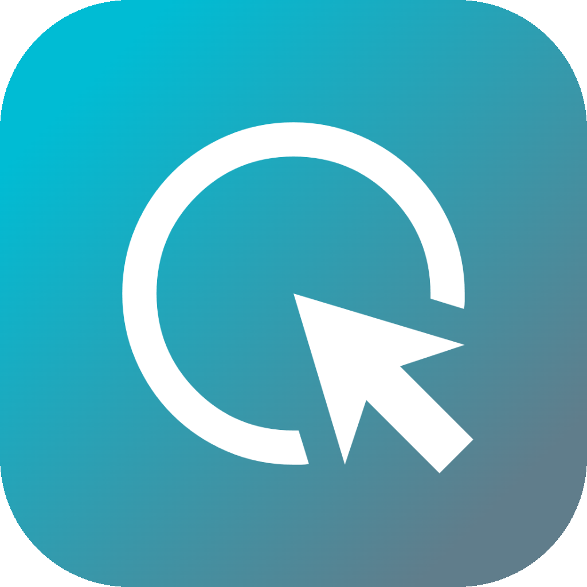

<div align="center">



# AirTap

**Your iPhone is now a wireless trackpad, keyboard & app launcher for your Mac.**

用 iPhone 隔空操控你的 Mac —— 触控板、键盘、手势、App 启动器，一切尽在指尖。

[](https://swift.org)
[](https://developer.apple.com/ios/)
[](https://developer.apple.com/macos/)
[](LICENSE)
[](https://github.com/HuangRunHua/the-airtap-app/stargazers)

<br>

> No third-party app to buy. No dongles. Just your iPhone and your Mac on the same Wi-Fi.

</div>

---

## Screenshots

| Portrait - App Launcher | Portrait - Trackpad |
|:---:|:---:|
|  |  |

| Landscape - App Launcher | Landscape - Trackpad + Shortcuts |
|:---:|:---:|
|  |  |

---

## Demo

### Launch App

[Launch App](pic/launch_app.mp4)

### Trackpad

[Trackpad](pic/trackpad.mp4)

### Delete App

[Delete App](pic/delete_app.mp4)

### Voice Control

[Voice Control](pic/voice_control.mp4)

---

## Highlights

| Feature | Description |
|---------|-------------|
| **App Launcher** | Browse and launch any Mac app from a beautiful adaptive grid (2x4 portrait / 4x2 landscape). Long-press to enter jiggle mode and rearrange — just like your Home Screen. |
| **Virtual Trackpad** | Non-linear acceleration, momentum scrolling, haptic feedback. Feels like a real Apple trackpad in your pocket. |
| **Gesture Controls** | Pinch to zoom in/out, two-finger double tap for smart zoom. Natural multi-touch gestures mapped directly to your Mac. |
| **Full Keyboard + IME** | Type in English, Chinese, or any language. Full Input Method Editor support with candidate selection. Return key maps to Mac Return. |
| **Shortcuts & Media** | One-tap access to Cmd+C, Cmd+V, Cmd+Tab, Cmd+W, Cmd+Z, Cmd+A, plus volume & playback controls. |
| **Liquid Glass UI** | Floating tab bar and collapsible shortcut pills with frosted-glass material — adapts seamlessly between portrait & landscape. |
| **Menu Bar App** | The Mac companion runs silently in the menu bar — no Dock icon, no clutter. |
| **Zero Config** | Bonjour auto-discovery. Open both apps, done. No IP address, no pairing code. |

---

## How It Works

```
┌──────────────┐        Bonjour Discovery        ┌──────────────┐
│   iPhone     │  ──────────────────────────────► │     Mac      │
│              │                                  │              │
│  NWBrowser   │       TCP Connection (JSON)      │  NWListener  │
│  (Client)    │  ◄──────────────────────────────►│  (Server)    │
│              │                                  │              │
│  Send Cmds   │   Mouse/Keyboard/App/Shortcuts   │  CGEvent     │
│  (RemoteCommand)                                │  Simulate    │
└──────────────┘                                  └──────────────┘
```

- **Discovery** — Mac registers `_macremote._tcp` via Bonjour; iPhone finds it automatically
- **Protocol** — TCP with 4-byte length prefix + JSON payload
- **Input** — Mac uses `CGEvent` API to simulate mouse, keyboard, and media events
- **Focus Detection** — Mac monitors text field focus via Accessibility API and notifies iPhone to show the keyboard indicator

---

## Requirements

| Platform | Minimum Version |
|----------|----------------|
| iOS / iPadOS | 16.0+ |
| macOS | 13.0+ (Ventura) |

Both devices must be on the **same local network**.

---

## Getting Started

### 1. Clone & Open

```bash
git clone https://github.com/HuangRunHua/the-airtap-app.git
cd the-airtap-app
open AirTap.xcodeproj
```

The project contains two targets:

| Target | Platform | Description |
|--------|----------|-------------|
| **AirTap** | iOS | Deploy to your iPhone / iPad |
| **AirTapMac** | macOS | Run on your Mac (menu bar app) |

### 2. Mac Setup

On first launch, grant **Accessibility** permission:

> System Settings → Privacy & Security → Accessibility → Enable **AirTapMac**

The Mac app runs as a **menu bar icon** — no Dock icon, no window, completely out of the way.

### 3. Connect

Open the iOS app — it auto-discovers your Mac. Allow **Local Network** access when prompted. Once connected, your Mac's name appears at the top. You're ready to go.

---

## Features in Detail

### App Launcher

- Auto-fetches installed Mac apps with icons
- 2x4 (portrait) / 4x2 (landscape) adaptive grid with pagination
- Long-press to enter jiggle mode (iOS-style wobble + delete badge)
- Tap feedback with scale and glow animation
- Persistent storage — your shortcuts survive app restarts
- Add duplicates for different workflows

### Virtual Trackpad

- **Single-finger drag** → Move cursor (non-linear acceleration curve)
- **Single-finger tap** → Left click
- **Two-finger tap** → Right click
- **Double tap** → Double click
- **Two-finger scroll** → Scroll with momentum physics
- **Pinch** → Zoom in / Zoom out
- **Two-finger double tap** → Smart zoom
- **Haptic feedback** on every interaction

### Keyboard & IME

- Full Chinese input (Pinyin) with candidate bar
- Input text stays visible in the text field
- Return key triggers Mac's Return
- Green indicator when Mac text field is focused
- Keyboard never blocks the tab bar

### Shortcuts & Media

| Shortcut | Action |
|----------|--------|
| `Cmd + C` | Copy |
| `Cmd + V` | Paste |
| `Cmd + Tab` | Switch App |
| `Cmd + W` | Close Tab |
| `Cmd + Z` | Undo |
| `Cmd + A` | Select All |
| `Vol +/-` | Volume Control |
| `Play/Pause` | Media Playback |

---

## Project Structure

```
AirTap/
├── AirTap/                         # iOS App
│   ├── ContentView.swift           # Main layout, tab bar, shortcuts overlay
│   ├── Services/
│   │   └── ConnectionManager.swift # Bonjour discovery & TCP connection
│   ├── Shared/
│   │   └── RemoteProtocol.swift    # Communication protocol definitions
│   ├── ViewModels/
│   │   └── RemoteViewModel.swift   # Business logic & persistence
│   └── Views/
│       ├── AppGridView.swift       # App grid (pagination, edit mode)
│       ├── AppIconView.swift       # App icon (glass effect, jiggle)
│       ├── AppPickerView.swift     # Add-app picker
│       ├── TrackpadView.swift      # Virtual trackpad & gesture input
│       └── ShortcutBarView.swift   # Shortcut bar
│
├── AirTapMac/                      # macOS Menu Bar App
│   ├── Services/
│   │   ├── CommandServer.swift     # TCP server & command dispatch
│   │   ├── InputSimulator.swift    # CGEvent input simulation
│   │   ├── AccessibilityMonitor.swift # Text field focus detection
│   │   └── AppManager.swift        # App scanning & icon extraction
│   └── Shared/
│       └── RemoteProtocol.swift    # Communication protocol (Mac side)
│
├── AppIcon.icon                    # Xcode Icon Composer asset
└── AirTap.xcodeproj
```

---

## Tech Stack

| Technology | Usage |
|-----------|-------|
| **SwiftUI** | iOS interface & layout |
| **Network.framework** | Bonjour discovery + TCP communication |
| **CGEvent** | macOS mouse & keyboard simulation |
| **Accessibility API** | macOS text field focus detection |
| **UIKit** | Gesture recognizers (pan, tap, pinch, long-press) |
| **Core Haptics** | Tactile feedback |

---

## Known Limitations

- Single Mac connection (auto-connects to the first discovered Mac)
- One controller device at a time
- Unencrypted communication (use on trusted networks only)
- No authentication — any device on the same network can connect

---

## Roadmap

- [x] Pinch-to-zoom gesture controls
- [ ] Multi-Mac device selection
- [ ] TLS encrypted communication
- [ ] PIN / password authentication
- [ ] Screen mirroring preview
- [ ] Custom shortcut configuration
- [ ] Apple Watch quick controls
- [ ] Widget for quick launch

---

## Contributing

Contributions are welcome! Feel free to open an issue or submit a pull request.

1. Fork the repo
2. Create your feature branch (`git checkout -b feature/amazing-feature`)
3. Commit your changes (`git commit -m 'Add amazing feature'`)
4. Push to the branch (`git push origin feature/amazing-feature`)
5. Open a Pull Request

---

## License

[Apache License 2.0](LICENSE) — use it, modify it, ship it.

---

## Acknowledgments

Inspired by [Choclift](https://choclift.com/). Built as a free, open-source alternative for Mac remote control.

---

<div align="center">

**If you find AirTap useful, consider giving it a ⭐!**

</div>
