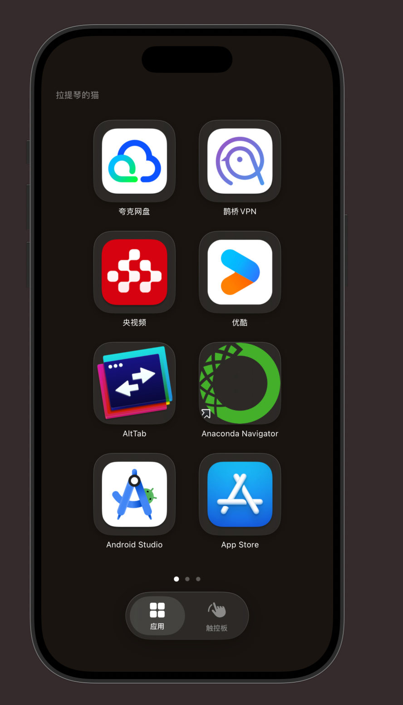
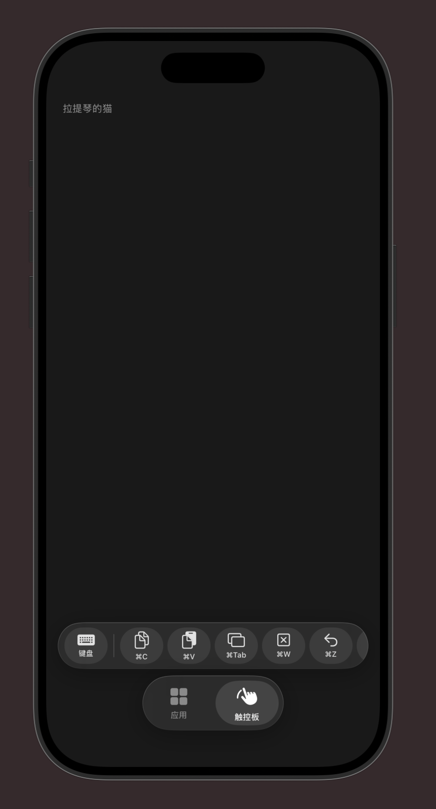
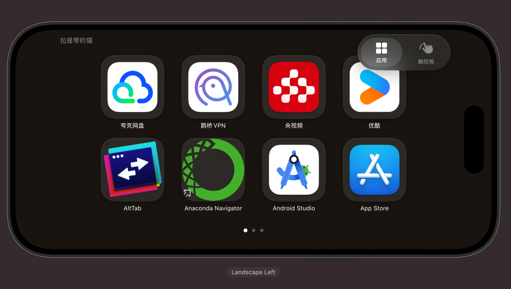
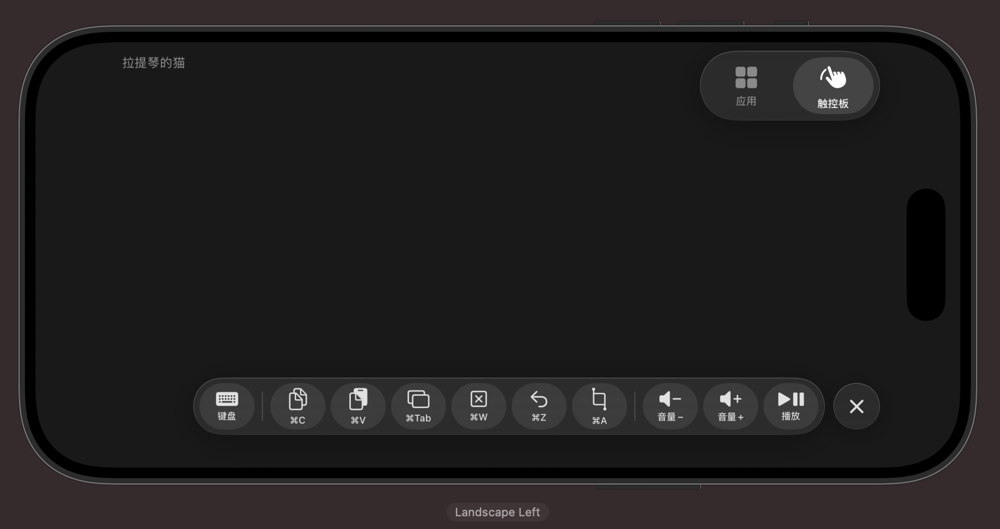

# RemoteControl

用 iPhone 远程控制你的 Mac —— 触控板、键盘、App 启动器，一切尽在掌中。

RemoteControl 是一组 iOS + macOS 原生应用，通过局域网让你的 iPhone / iPad 变成 Mac 的无线触控板、键盘和应用启动器。适合投屏演示、沙发上操控 Mac、或任何不想走到电脑前的场景。

## 截图预览

| 竖屏 - 应用启动器 | 竖屏 - 虚拟触控板 |
|:---:|:---:|
|  |  |

| 横屏 - 应用启动器 | 横屏 - 触控板 + 快捷栏 |
|:---:|:---:|
|  |  |

---

## 功能亮点

### 应用启动器

- 自动读取 Mac 上已安装的应用，支持搜索和添加
- 2×4 / 4×2 自适应网格布局，大图标一目了然
- 长按进入编辑模式（iOS 风格抖动 + 删除），支持添加重复快捷方式
- 分页浏览，自动持久化你的选择

### 虚拟触控板

- **单指滑动** → 移动鼠标（非线性加速度，还原真实触控板手感）
- **单指点击** → 左键
- **双指点击** → 右键
- **双击** → 双击
- **双指滑动** → 滚动（带惯性和动量物理效果）
- 触觉反馈（Haptic Feedback），操作有手感

### 键盘输入

- 支持完整的中文输入法（IME），拼音候选词正常工作
- 输入内容保留在输入框中，方便查看和修改
- Return 键直接触发 Mac 回车
- Mac 文本框获得焦点时，键盘按钮显示绿色指示灯

### 快捷键 & 媒体控制

| 快捷键 | 功能 |
|--------|------|
| ⌘C | 复制 |
| ⌘V | 粘贴 |
| ⌘Tab | 切换应用 |
| ⌘W | 关闭标签页 |
| ⌘Z | 撤销 |
| ⌘A | 全选 |

音量调节（+/-）和播放/暂停，一键控制。

### UI 设计

- Liquid Glass 液态玻璃风格浮动 Tab 栏和快捷按钮
- 横屏 / 竖屏自适应布局
  - 竖屏：底部居中 Tab，快捷栏浮动
  - 横屏：Tab 右上角，快捷栏右下角可折叠
- 深色主题，沉浸式体验

---

## 系统要求

| 平台 | 最低版本 |
|------|---------|
| iOS / iPadOS | 16.0+ |
| macOS | 13.0+ (Ventura) |

iOS 和 Mac 需要在 **同一局域网** 下。

---

## 快速开始

### 1. 构建 & 运行

```bash
# 克隆项目
git clone https://github.com/your-username/RemoteControl.git
cd RemoteControl

# 使用 Xcode 打开
open RemoteControl.xcodeproj
```

项目包含两个 Target：

- **RemoteControl** — iOS 应用，部署到 iPhone / iPad
- **RemoteControlMac** — macOS 应用，运行在你的 Mac 上

### 2. Mac 端设置

首次运行 Mac 应用时，需要授予 **辅助功能权限**：

> 系统设置 → 隐私与安全性 → 辅助功能 → 勾选 RemoteControlMac

这是模拟鼠标/键盘输入所必需的。Mac 应用以菜单栏图标形式运行，不会出现在 Dock 中。

### 3. iOS 端连接

打开 iOS 应用，它会自动搜索局域网内的 Mac。首次使用时系统会请求 **本地网络权限**，请允许。

连接成功后，你会看到 Mac 名称显示在顶部，即可开始使用。

---

## 工作原理

```
┌──────────────┐          Bonjour 发现          ┌──────────────┐
│   iPhone     │  ──────────────────────────►  │     Mac      │
│              │                               │              │
│  NWBrowser   │       TCP 连接 (JSON)         │  NWListener  │
│  (客户端)    │  ◄────────────────────────►  │  (服务端)    │
│              │                               │              │
│  发送命令    │   鼠标/键盘/App/快捷键/媒体    │  CGEvent     │
│  (RemoteCommand)                             │  模拟输入    │
└──────────────┘                               └──────────────┘
```

- **发现**：Mac 注册 Bonjour 服务 `_macremote._tcp`，iOS 自动发现
- **通信**：TCP 连接，消息格式为 4 字节长度头 + JSON 载荷
- **输入模拟**：Mac 端使用 `CGEvent` API 模拟鼠标移动、点击、键盘输入
- **焦点检测**：Mac 端通过 Accessibility API 检测文本框焦点状态，通知 iOS 显示键盘提示

---

## 项目结构

```
RemoteControl/
├── RemoteControl/                  # iOS 应用
│   ├── ContentView.swift           # 主布局、Tab 栏、快捷栏
│   ├── Services/
│   │   └── ConnectionManager.swift # Bonjour 发现 & TCP 连接
│   ├── Shared/
│   │   └── RemoteProtocol.swift    # 通信协议定义
│   ├── ViewModels/
│   │   └── RemoteViewModel.swift   # 业务逻辑 & 持久化
│   └── Views/
│       ├── AppGridView.swift       # 应用网格（分页、编辑）
│       ├── AppIconView.swift       # 应用图标（液态玻璃、抖动）
│       ├── AppPickerView.swift     # 添加应用选择器
│       ├── TrackpadView.swift      # 虚拟触控板 & 键盘输入
│       └── ShortcutBarView.swift   # 快捷栏
│
├── RemoteControlMac/               # macOS 应用
│   ├── Services/
│   │   ├── CommandServer.swift     # TCP 服务端 & 命令处理
│   │   ├── InputSimulator.swift    # CGEvent 输入模拟
│   │   ├── AccessibilityMonitor.swift # 焦点检测
│   │   └── AppManager.swift        # 应用扫描 & 图标获取
│   └── Shared/
│       └── RemoteProtocol.swift    # 通信协议（Mac 侧）
│
└── RemoteControl.xcodeproj
```

---

## 技术栈

- **SwiftUI** — iOS 界面
- **Network.framework** — Bonjour 服务发现 + TCP 通信
- **CGEvent** — macOS 鼠标/键盘输入模拟
- **Accessibility API** — macOS 文本框焦点检测
- **UIKit** — 手势识别器（`UIPanGestureRecognizer`、`UITapGestureRecognizer`）
- **Core Haptics** — 触觉反馈

---

## 已知限制

- 仅支持单台 Mac 连接（自动连接第一个发现的 Mac）
- Mac 端同时只接受一个控制设备
- 通信未加密（仅限信任的局域网使用）
- 无认证机制，同一网络下即可连接

---

## 路线图

- [ ] 多 Mac 设备选择
- [ ] TLS 加密通信
- [ ] 连接密码 / PIN 认证
- [ ] 屏幕镜像预览
- [ ] 自定义快捷键
- [ ] Apple Watch 快捷控制

---

## 许可证

[MIT License](LICENSE)

---

## 致谢

灵感来自 [Choclift](https://choclift.com/)，致力于打造一个开源、免费的 Mac 远程控制方案。
